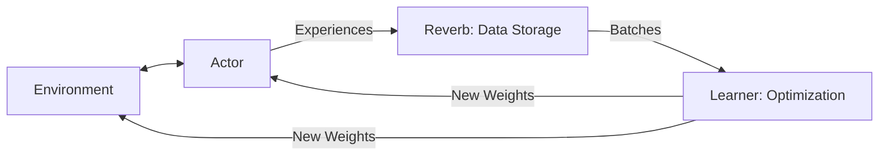

# ACME Framework (Modular RL)

🧠 **What does this do? (The Analogy)**
Think of a **Lego Set for Robots**. 
- In the old days, every AI researcher built their robot from scratch using custom pieces. 
- **ACME** is a standardized set of Lego bricks. 
- You have a "Learner" brick, an "Actor" brick, and a "Dataset" brick. 
- Because the bricks all fit together perfectly, you can swap a "DQN Learner" for a "PPO Learner" without changing any other part of the system. 
It is the framework that allows DeepMind to build the world's most complex AIs by reusing stable, modular components.

🔍 **Step-by-Step Explanation:**
1. **The Actor**: Responsible only for looking at the screen and pressing buttons. It doesn't know how to learn.
2. **The Learner**: Responsible only for doing the math and updating the brain. It doesn't know how to play the game.
3. **The Dataset (Reverb)**: A high-performance "bucket" that holds the experiences and passes them from the Actor to the Learner.
4. **Benefit**: It is **Scalable**. You can run the Actor on a phone and the Learner on a supercomputer, and ACME handles the connection.

📊 **High-Level Design (HLD)**

✅ **Why use this?**
It is the best choice for **Industrial-Grade RL**. If you are building a real product that uses RL, you use ACME to ensure your code is clean, testable, and can scale from 1 computer to 1,000 without a rewrite.

🌍 **Real-World Examples:**
1. **DeepMind Research**: ACME is the internal engine used for almost all of DeepMind's recent breakthroughs.
2. **Robotics Control**: Using ACME to separate the "Physical Robot" (The Actor) from the "Training Cloud" (The Learner).
