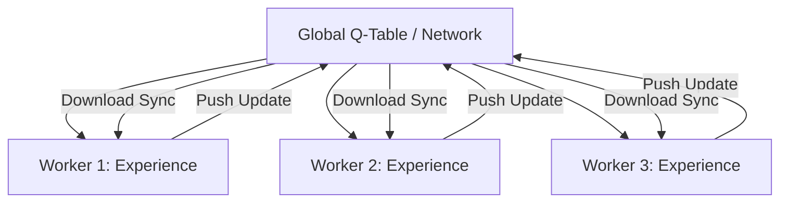

# Asynchronous Sarsa (A-Sarsa)

🧠 **What does this do? (The Analogy)**
Think of a **Team of Spies**. Each spy (Worker) is in a different city, trying to find a target. When a spy learns something important (e.g., "The target likes Italian food"), they immediately send a message to the **Central HQ** (Global Brain). HQ updates the master file and sends the new info back to all the other spies. **A-Sarsa** is the distributed version of the classic Sarsa algorithm, allowing it to learn from many environments at once.

🔍 **Step-by-Step Explanation:**
1. **The Workers**: Multiple agents running in separate environments (CPU threads).
2. **On-Policy**: Each worker follows its own policy and calculates updates based on its own specific experiences.
3. **Async Updates**: Workers don't wait for each other. As soon as a worker has a gradient, it pushes it to the Global Brain.
4. **Benefit**: It is much faster and more "Diverse" than standard Sarsa. It avoids the problem of an agent getting stuck in a single bad "loop."

📊 **High-Level Design (HLD)**

✅ **Why use this?**
It was the foundation for the "Asynchronous Advantage Actor-Critic" (A3C) revolution. It proved that we don't need a "Replay Buffer" if we have enough parallel workers to provide diverse data. It is very efficient on multi-core CPUs.

🌍 **Real-World Examples:**
1. **Parallel Web Crawling**: Using multiple bots to learn the best way to navigate a website simultaneously.
2. **Cloud-Based Industrial Control**: Coordinating multiple factory machines across different cities that all contribute to a single master "Efficiency AI."
