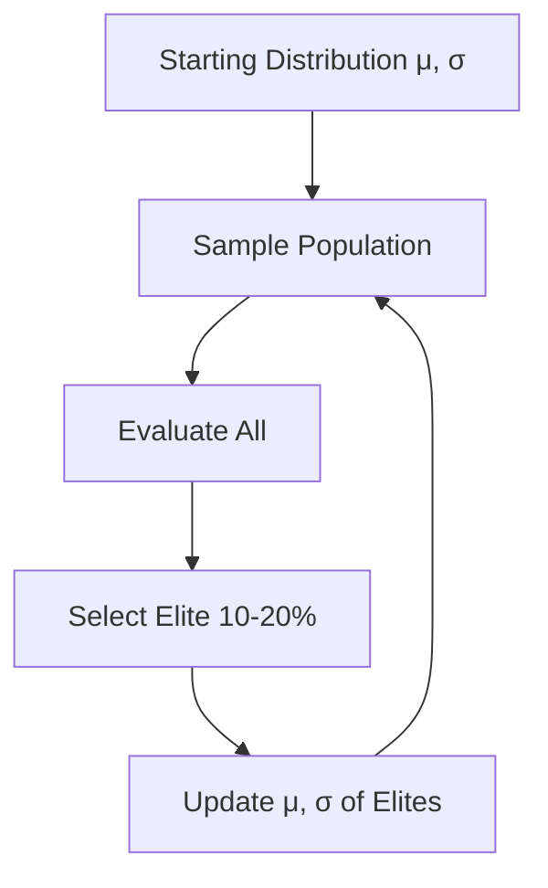

# Cross-Entropy Method (CEM)

🧠 **What does this do? (The Analogy)**
Think of a **Talent Show**. You have 100 random people perform on stage (Sampling). You pick the **10 best performers** (The Elites). You then look at what made those 10 people special and you find more people just like them for the next show. Each time, the average quality of the performers goes up until everyone on stage is a superstar.

🔍 **Step-by-Step Explanation:**
1. **The Distribution**: We start with a Mean ($\mu$) and a Spread ($\sigma$) of possible parameters.
2. **Sampling**: We generate a batch of random agents from this distribution.
3. **Selection**: We test all agents and keep only the "Elites" (the top performers).
4. **Refitting**: we calculate the new $\mu$ and $\sigma$ of just the Elites.
5. **Convergence**: The distribution naturally "shrinks" and moves toward the optimal solution.

📊 **High-Level Design (HLD)**

✅ **Why use this?**
It is incredibly simple and often works better than complex gradient-based RL for low-dimensional problems. It is the "dumb but effective" cousin of Evolution Strategies.

🌍 **Real-World Examples:**
1. **Web Layout Optimization**: Generating 100 different button colors, picking the 10 that get the most clicks, and refining the next batch based on those winning colors.
2. **Simple Robotic Control**: Finding the best angle for a robotic arm to throw a ball by sampling many angles and focusing on the ones that hit the target.
