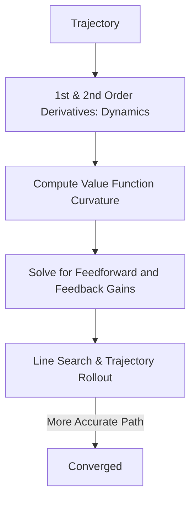

# DDP (Differential Dynamic Programming)

🧠 **What does this do? (The Analogy)**
Think of a **Cartographer mapping a canyon**. 
- iLQR is like a mapmaker who only sees the **Slope** of the ground. 
- **DDP** is like a mapmaker who also sees the **Curves and Bumps** (Curvature).
Because DDP sees how the world "bends" (Second-order derivatives), it can find paths that are much more precise and efficient than iLQR, especially in very "unstable" situations like a robot balancing on a thin pole.

🔍 **Step-by-Step Explanation:**
1. **Higher-Order Math**: DDP uses the second-order Taylor expansion of both the Cost AND the Dynamics.
2. **The f_uu Term**: This is the key. It accounts for how the "Action" itself changes the "Shape" of the system.
3. **Quadratic Convergence**: Because it uses second-order info, it often finds the optimal path in fewer steps (iterations) than first-order methods.

📊 **High-Level Design (HLD)**

✅ **Why use this?**
It is the most accurate "Local" optimizer in control theory. If you are building a **High-Precision Industrial Robot** that needs to move at high speed without shaking, DDP is the math you use.

🌍 **Real-World Examples:**
1. **Dynamic Legged Locomotion**: Helping robots like Atlas run and jump by accounting for the complex physics of ground contact.
2. **UAV High-Speed Racing**: Planning the bank-and-turn movements of a drone through a forest where tiny errors lead to a crash.
