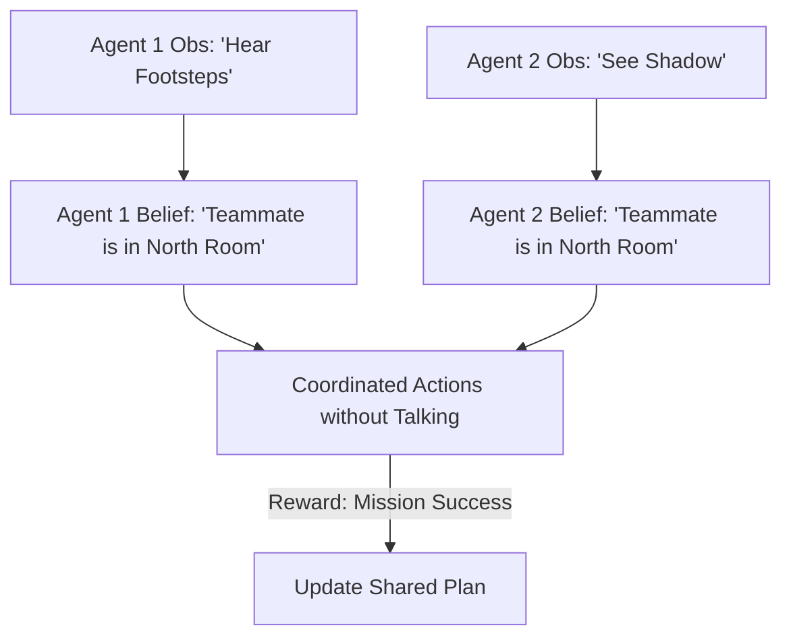

# Dec-POMDP (Decentralized Partially Observable MDP)

🧠 **What does this do? (The Analogy)**
Think of a **SWAT Team entering a dark building**. 
- Each team member only sees what is in their flashlight beam (Partial Observation). 
- They cannot see through walls, and they might not even be able to talk to each other. 
- However, they have a **Plan (Shared Policy)**. 
- Because they all know the plan, each person can "Guess" where their teammates are based only on what they see. 
**Dec-POMDP** is the mathematical framework for coordinating a team when everyone is "Half-Blind" but working toward a single goal.

🔍 **Step-by-Step Explanation:**
1. **Partial Observability**: Agents never see the "True State" of the world. They only see "Noisy Hints" (Observations).
2. **Belief State**: Each agent maintains a "Mental Map" (Probability Distribution) of where they think everyone and everything is.
3. **Joint Reward**: The whole team succeeds or fails together.
4. **Benefit**: It is the most realistic model of the real world, where communication is limited and data is incomplete.

📊 **High-Level Design (HLD)**

✅ **Why use this?**
It is the gold standard for **Space Exploration** or **Deep Sea Robotics**. When robots are millions of miles away and cannot talk to Earth or each other instantly, Dec-POMDP allows them to coordinate their actions "silently."

🌍 **Real-World Examples:**
1. **Mars Rover Fleets**: Multiple rovers exploring a crater where hills block their radio signals.
2. **Submarine Coordination**: Using sonar "blips" to stay in formation without revealing their location to an enemy.
