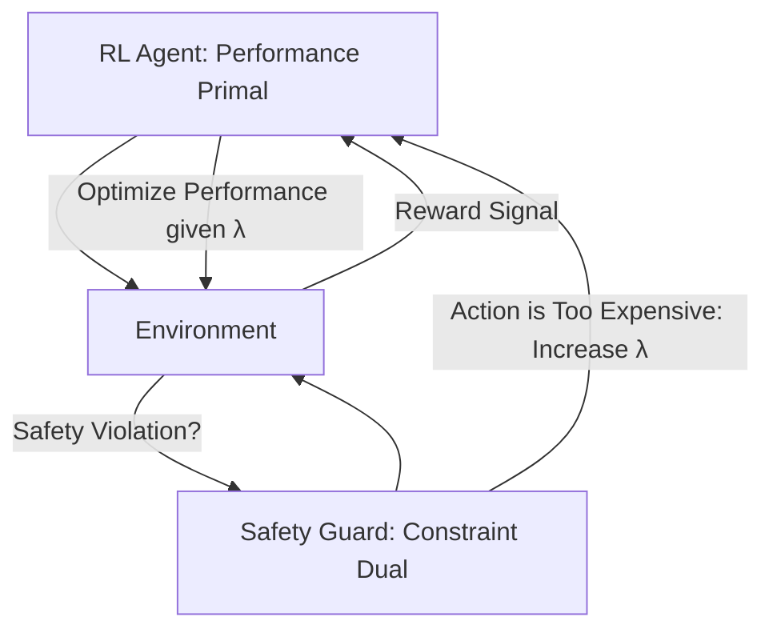

# Dual Policy Iteration (Constrained RL)

🧠 **What does this do? (The Analogy)**
Think of a **Company Budget**. 
- **Primal Goal**: The marketing team wants to spend $1,000,000 to get new customers (Maximize Reward). 
- **Dual Goal**: The accounting team says the total spend must be less than $500,000 (Safety/Resource Constraint). 
**Dual Policy Iteration** is the "Negotiation" between these two teams. It finds the mathematical "Lagrange Multiplier" (the price of the constraint) that allows the marketing team to be as successful as possible without ever breaking the accountant's budget.

🔍 **Step-by-Step Explanation:**
1. **The Duality**: Every RL problem has a "Primal" (The Agent) and a "Dual" (The Cost/Constraint).
2. **Lagrange Multiplier ($\lambda$)**: This acts as a "Internal Price." If the agent breaks a safety rule, the price $\lambda$ goes up, making that action "too expensive" to take.
3. **Optimality**: When the Primal and Dual are in balance (Saddle Point), you have a policy that is perfectly optimized for performance while being 100% safe.
4. **Benefit**: This is the engine behind **CPO (Constrained Policy Optimization)**. It is much more powerful than simply "Subtracting points for a crash."

📊 **High-Level Design (HLD)**

✅ **Why use this?**
It is the only way to solve **Resource-Constrained RL**. If you have a drone with a small battery, or a robot that must not exceed a specific temperature, you use Dual Policy Iteration to "Price" those constraints into the AI's logic.

🌍 **Real-World Examples:**
1. **5G Network Slicing**: Maximizing the speed for 1,000 users while "Dual Constraining" the total bandwidth so the network doesn't collapse.
2. **Industrial Cooling**: Maximizing factory production while keeping the "Dual Cost" of electricity within a specific monthly budget.
3. **Safe Autonomous Driving**: Maximizing speed while ensuring the "Probability of Collision" is mathematically kept below 0.00001%.
