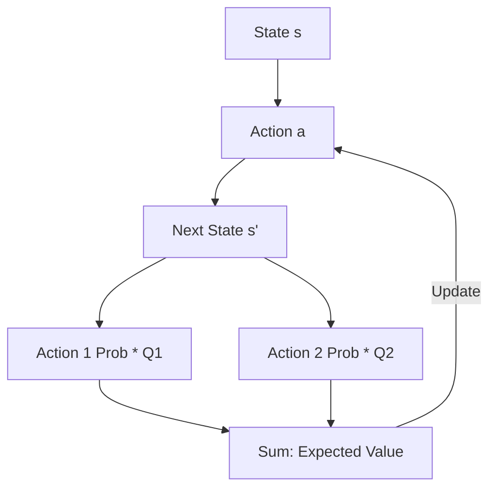

# Expected Sarsa (Stable Learning)

🧠 **What does this do? (The Analogy)**
Think of a **Cautious Hiker**. Standard Q-Learning is "reckless"—it always looks at the best possible outcome, even if it's a 1-in-1000 lucky jump. **Expected Sarsa** is "cautious." It looks at the **average** outcome of all actions it might take. It's like a hiker who says: "If I go this way, there's a 90% chance of a safe path and a 10% chance of falling. I'll take the average of both." It is much more stable and safer than Q-learning.

🔍 **Step-by-Step Explanation:**
1. **The Q-Learning update**: Uses $\max Q(s', a')$.
2. **The Expected Sarsa update**: Uses $\sum \pi(a'|s') Q(s', a')$.
3. **Probability Weighted**: It considers the probability ($\pi$) of taking each action in the next state.
4. **The Benefit**: It reduces the "jitter" and overestimation in learning. If an action is occasionally great but usually terrible, Expected Sarsa will correctly identify it as a bad choice overall.

📊 **High-Level Design (HLD)**

✅ **Why use this?**
It is one of the most stable "On-Policy" algorithms. It is particularly good in environments with lots of randomness (stochasticity) where taking the `max` can lead to massive errors.

🌍 **Real-World Examples:**
1. **Traffic Light Coordination**: Predicting the average wait time across all lanes rather than just the one "best case" lane.
2. **HVAC Control**: Calculating the average energy savings of several cooling strategies to avoid a "risky" setting that might cause equipment wear.
