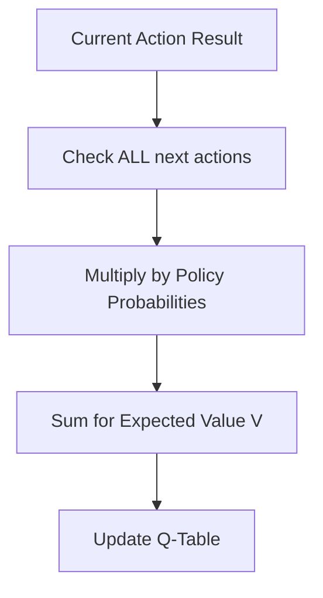

# Expected Sarsa

🧠 **What does this do? (The Analogy)**
Think of a **Safe Gambler**. In standard Sarsa, the gambler looks at the *one* card they just drew. If the card is bad, they panic. In **Expected Sarsa**, the gambler looks at the whole deck. They say: "I might have drawn a bad card, but *on average*, this is a good deck to play." By looking at the **average** of what could happen next, the AI stays calm and stable even if one specific step went wrong.

🔍 **Step-by-Step Explanation:**
1. **The Target**: Standard Sarsa uses $Q(s', a')$. Expected Sarsa uses $\sum \pi(a'|s') Q(s', a')$.
2. **Variance Reduction**: Because it uses the "Expected" (Average) value, the updates are much smoother and less random.
3. **Off-policy capability**: Unlike standard Sarsa, Expected Sarsa can learn from a random policy and still find the perfect strategy.
4. **Benefit**: It is more computationally expensive than Sarsa, but it learns in fewer steps because every update is more "trustworthy."

📊 **High-Level Design (HLD)**

✅ **Why use this?**
It is the "Gold Standard" for stability in simple RL. If you have a task like a robotic vacuum cleaner or a traffic light where you want the AI to be **steady and predictable**, you use Expected Sarsa.

🌍 **Real-World Examples:**
1. **Inventory Management**: Predicting stock needs by looking at the "Average" customer demand rather than reacting to a single unusual purchase.
2. **Elevator Routing**: Planning the next floor by looking at the "Expected" number of button presses across all floors.
