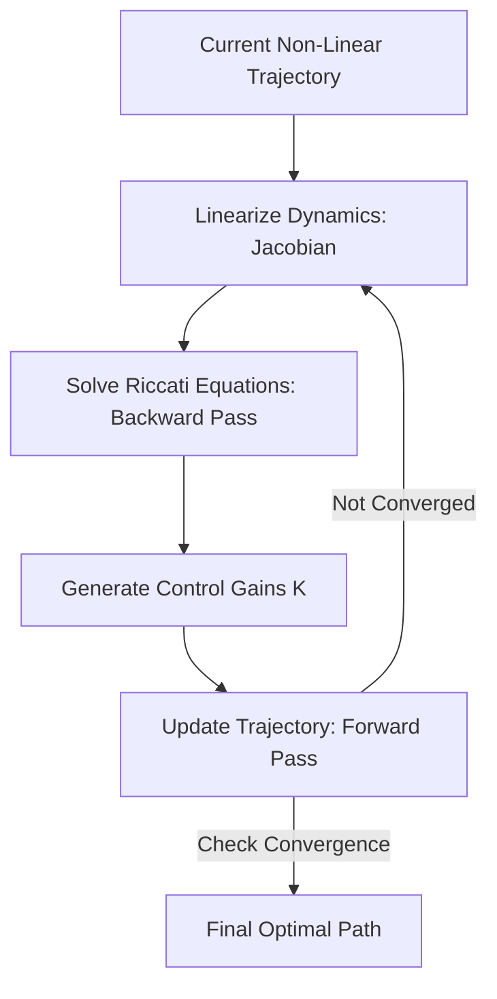

# iLQR (Iterative Linear Quadratic Regulator)

🧠 **What does this do? (The Analogy)**
Think of a **Car driving on a curvy mountain road**. Standard LQR only works on a flat, straight road. **iLQR** is like a driver who looks 10 meters ahead, "pretends" that small section of the road is straight, calculates the best turn, and then repeats that for the next 10 meters. By "stitching together" thousands of small straight lines, it can navigate a complex, twisting path perfectly.

🔍 **Step-by-Step Explanation:**
1. **Linearization**: Taking a complex, non-linear system (like a robot arm) and calculating the "Slope" (Taylor expansion) at the current point.
2. **Backward Pass**: Calculating the optimal control gains ($K$) starting from the goal and working backwards to the current state.
3. **Forward Pass**: Executing the control and updating the trajectory.
4. **Iterative Refinement**: Repeating the process until the path is smooth and perfect.

📊 **High-Level Design (HLD)**

✅ **Why use this?**
It is the standard for **Trajectory Optimization** in robotics. If you want a 4-legged robot to jump over a gap, you use iLQR to find the perfect sequence of leg forces.

🌍 **Real-World Examples:**
1. **Rocket Landing (SpaceX style)**: Calculating the complex aerodynamic and thruster adjustments needed to land a rocket vertically on a drone ship.
2. **Autonomous Stunt Driving**: Planning the high-speed drifting and sliding movements for a self-driving race car.
