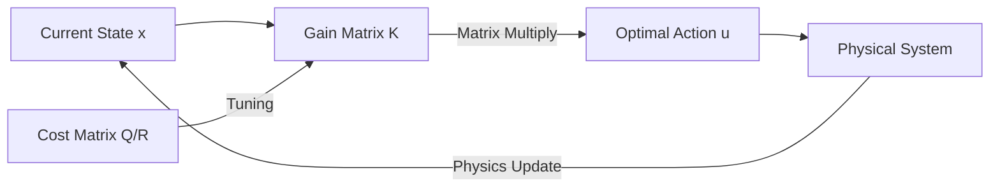

# Linear Quadratic Regulator (LQR)

🧠 **What does this do? (The Analogy)**
Think of a **Perfect Driver** on a straight road. If a gust of wind pushes the car 1 meter to the left, the driver knows **exactly** how much to turn the wheel to get back to the center using the **least amount of effort**. **LQR** is the math that calculates that "Perfect Turn." It is the grandfather of Reinforcement Learning. While RL "guesses" how to act, LQR "calculates" the perfect answer using physics and calculus.

🔍 **Step-by-Step Explanation:**
1. **The System ($A, B$)**: A mathematical model of how the world moves ($A$ is inertia, $B$ is your power).
2. **The Cost ($Q, R$)**: 
   - $Q$: How much you hate being off-track (State Error).
   - $R$: How much you hate using fuel (Control Effort).
3. **The Objective Function**: 
   $$J = \sum (x^T Q x + u^T R u)$$
4. **The Solution**: By solving the **Riccati Equation**, we find a constant matrix **K**. The best action is always $u = -Kx$.
5. **Stability**: If the math works, the system is guaranteed to be stable and smooth.

📊 **High-Level Design (HLD)**

✅ **Why use this?**
It is the standard for **Aerospace and Robotics**. If you are building a drone that needs to hover perfectly in place, or a satellite that needs to point at Earth, you use LQR. It is much more reliable and efficient than Deep RL for linear systems.

🌍 **Real-World Examples:**
1. **Self-Balancing Robots**: Segways and two-legged robots use LQR to stay upright by calculating the exact torque needed to counter gravity.
2. **Cruise Control**: Maintaining a perfectly steady speed in a car while using the minimum amount of fuel.
