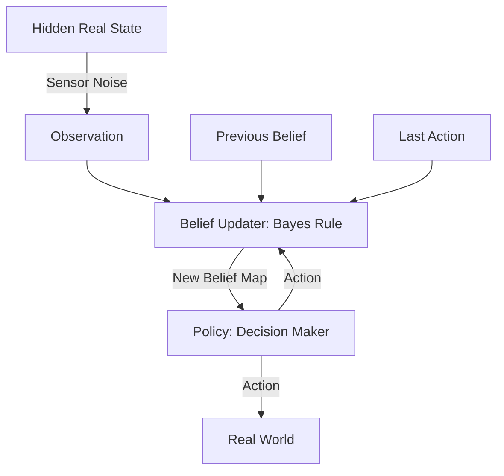

# POMDP (Partially Observable MDP)

🧠 **What does this do? (The Analogy)**
Think of a **Submarine Captain in a storm**. They can't see the outside world directly (Partial Observability). They only have a **Sonar** (Observations) that is sometimes noisy or wrong. The Captain maintains a **Map of Probabilities** (Belief State) in their head: "I am 70% sure I am near the coast and 30% sure I am in open water." Every action they take and every beep of the sonar updates this map. They don't react to what they *see*; they react to what they *believe*.

🔍 **Step-by-Step Explanation:**
1. **Hidden States ($S$)**: The real world, which the agent cannot see directly.
2. **Observations ($O$)**: Noisy or incomplete data received from sensors.
3. **Belief State ($b$)**: A probability distribution over all possible states. It is a "Sufficient Statistic," meaning it contains all the information from the past.
4. **Bayesian Update**: When the agent takes an action and sees an observation, it uses Bayes' Rule to update the probability of being in each state.
5. **The Goal**: Maximize reward based on the *Belief State* rather than the raw observation.

📊 **High-Level Design (HLD)**

✅ **Why use this?**
Standard RL fails in the real world because sensors are never perfect. POMDPs provide the mathematical framework for handling **Uncertainty**. It is the foundation for robotics, medical diagnosis, and strategic games like Poker.

🌍 **Real-World Examples:**
1. **Autonomous Driving in Fog**: Using LiDAR and Radar observations to maintain a belief about where the road lines and other cars are, even when they aren't visible.
2. **Medical Diagnosis AI**: Treating a patient based on a belief about their underlying disease, where each medical test is an observation that updates that belief.
