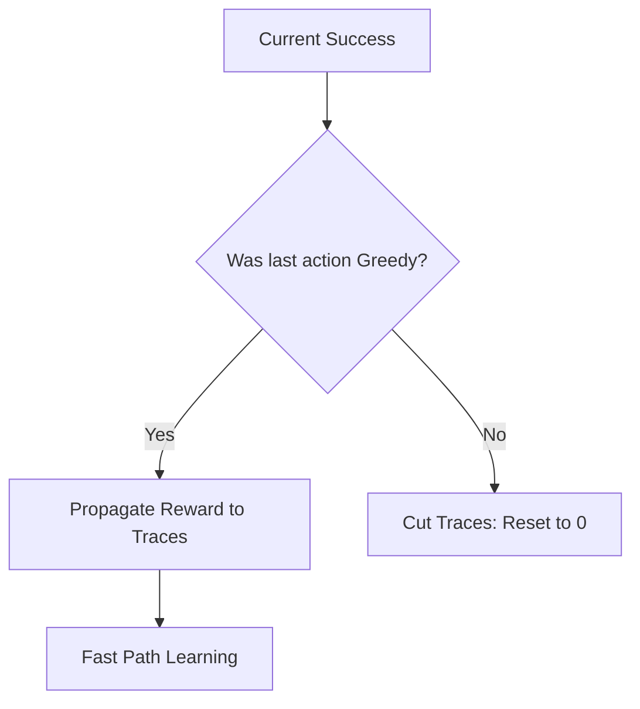

# Q(λ) (Watkins' Eligibility Traces)

🧠 **What does this do? (The Analogy)**
Think of a **Rewind Button**. Standard Q-learning only cares about the very last thing you did. **Q(λ)** allows the AI to "rewind" through its past actions and apply credit to all of them. However, there's a catch: if the AI did something **random/crazy** (Exploration) in the middle of the path, the "rewind" stops. It only rewards past steps that were part of a "Sensible" plan.

🔍 **Step-by-Step Explanation:**
1. **Off-Policy Traces**: Like Sarsa(λ), it uses Eligibility Traces to reward past states.
2. **The "Greedy" Rule**: Because Q-learning is about finding the *best* path, we only propagate rewards backward as long as the agent was taking the "Best" actions.
3. **Trace Cutting**: If the agent takes a random action to explore, the traces are reset to zero. This is because we don't want to reward past actions for a "lucky" random fluke.
4. **Benefit**: It is much faster than standard Q-learning but more stable than pure Monte Carlo.

📊 **High-Level Design (HLD)**

✅ **Why use this?**
It is the classic way to make Q-learning sample-efficient. Before we had "Experience Replay" buffers, Q(λ) was the main way we made AI learn from its past quickly.

🌍 **Real-World Examples:**
1. **Warehouse Robot Navigation**: Learning to find a shelf faster by rewarding every turn in a successful path, but ignoring "accidental" shortcuts that can't be repeated.
2. **Quality Control**: Rewarding a series of machine settings that produced a perfect product, as long as those settings were part of the AI's intended strategy.
