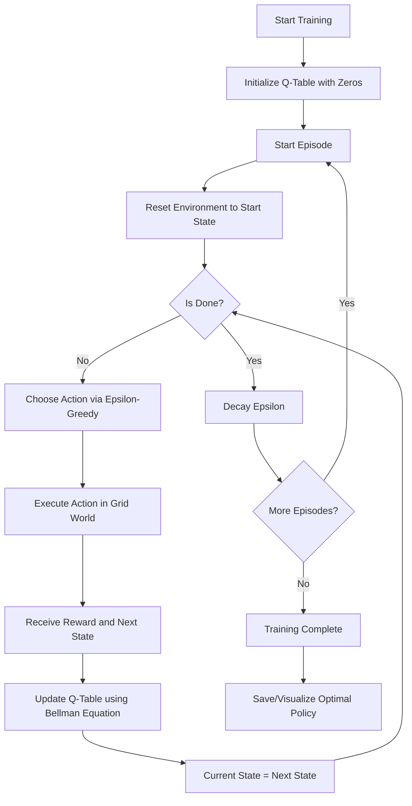

# Module 1: Q-Learning Deep Dive

## Introduction to Q-Learning
Q-Learning is a **Model-Free, Off-Policy Reinforcement Learning algorithm** used to find the optimal action-selection policy for any given Markov Decision Process (MDP). It falls under the category of **Temporal Difference (TD) Learning**.

- **Model-Free**: It doesn't need to know the dynamics of the environment (transition probabilities).
- **Off-Policy**: It learns the value of the optimal policy independently of the agent's actions.

## Core Concepts

### 1. The Q-Table
The "Q" in Q-learning stands for **Quality**. The Q-table is a lookup table where rows represent **States** and columns represent **Actions**. 
- In our Grid World (5x5), there are **25 states**.
- Each state has **4 possible actions** (Up, Down, Left, Right).
- The value $Q(s, a)$ represents the expected future reward for taking action $a$ in state $s$.

### 2. The Q-Learning Update Rule (Bellman Equation)
The heart of the algorithm is the update formula:

$$Q(s, a) \leftarrow Q(s, a) + \alpha \left[ R + \gamma \max_{a'} Q(s', a') - Q(s, a) \right]$$

Where:
- $\alpha$ (Alpha): **Learning Rate** (how much we trust new info).
- $\gamma$ (Gamma): **Discount Factor** (importance of future vs. immediate rewards).
- $R$: **Reward** received after taking action $a$.
- $\max_{a'} Q(s', a')$: **Estimate of optimal future value** (the "Off-Policy" part).

### 3. Exploration vs. Exploitation (Epsilon-Greedy)
To learn effectively, the agent must balance:
- **Exploration**: Trying new actions to find better rewards (Random action).
- **Exploitation**: Using what it already knows (Action with highest Q-value).
- **Epsilon ($\epsilon$)**: Probability of choosing a random action. It usually starts high (1.0) and decays over time.

---

## High-Level Design (HLD)

---

## Why Q-Learning?
- **Foundational**: It is the simplest form of Reinforcement Learning, making it perfect for understanding the core math of RL.
- **Provably Optimal**: For finite MDPs, Q-learning is guaranteed to find the optimal policy given enough exploration.
- **Model-Free**: It works even if you don't know how the world works; it learns purely by trial and error.

### Pros and Cons
| Pros | Cons |
| :--- | :--- |
| Easy to understand and implement | Does not scale to large state spaces |
| Guaranteed convergence in simple tasks | "Curse of Dimensionality" (Too many states) |
| Off-policy (Can learn from any data) | Cannot handle continuous actions/states |

---

## Frequently Asked Questions (FAQ)

**Q: Why do we use a negative reward for steps?**
A: To prevent the agent from wandering around forever. A small negative reward makes it "expensive" to take more steps, forcing it to find the shortest path to the goal.

**Q: What happens if Gamma ($\gamma$) is 0?**
A: The agent becomes "myopic" or short-sighted. It only cares about the immediate reward and ignores future benefits.

**Q: Why initialize the Q-table with zeros?**
A: It's a neutral starting point. As the agent explores and finds rewards, these values will be updated to reflect reality.

---
*Created for Reinforcement Learning Module-1 Learning Path.*
