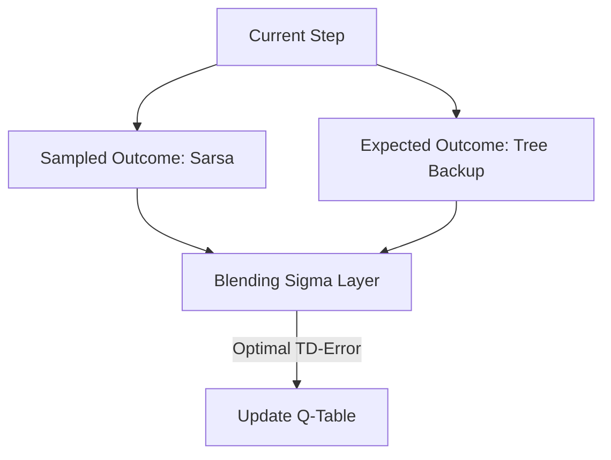

# Q(σ) (The Unified Multi-step Algorithm)

🧠 **What does this do? (The Analogy)**
Think of a **Weather Forecast**. You can look at the **Actual Rain** that happened today (Sampled) or you can look at the **Mathematical Probability** of rain (Expected). **Q(σ)** is a slider that lets you choose.
- If you move the slider to the left, you trust the **Math** (Stable but biased).
- If you move the slider to the right, you trust the **Reality** (Accurate but shaky).
By finding the perfect spot in the middle, the AI learns faster and better than using only one or the other.

🔍 **Step-by-Step Explanation:**
1. **The Sigma ($\sigma$)**: A parameter between 0 and 1.
2. **The Components**: 
   - **Sampled Step**: Uses the actual reward and next action taken (Sarsa-like).
   - **Expected Step**: Uses the weighted average of all possible next actions (Expected-Sarsa-like).
3. **The Blend**: $V = \sigma \cdot \text{Sampled} + (1 - \sigma) \cdot \text{Expected}$.
4. **Benefit**: It is the "Universal Language" of multi-step RL. It allows you to tune the agent to the specific environment.

📊 **High-Level Design (HLD)**

✅ **Why use this?**
It is the most advanced "Classic" RL algorithm. It allows you to combine the best parts of **Sarsa**, **Expected Sarsa**, and **Tree Backup** into a single, high-performance brain.

🌍 **Real-World Examples:**
1. **Energy Grid Balancing**: Blending the "Actual usage" data with the "Mathematical model" of usage to predict power surges.
2. **Financial Market Prediction**: Combining "Real-time trades" with "Statistical market models" to make the most stable and accurate price predictions.
