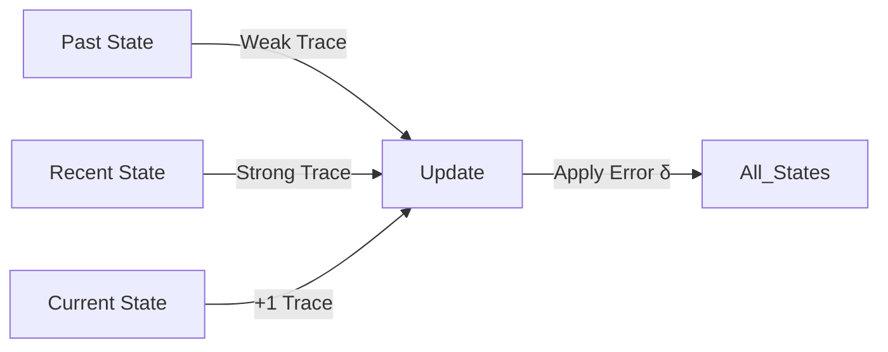

# Sarsa(λ) (Eligibility Traces)

🧠 **What does this do? (The Analogy)**
Think of a **Scent Trail**. If you find a piece of cheese at the end of a maze, standard Sarsa only rewards the very last turn you made. **Sarsa(λ)** is like leaving a trail of perfume as you walk. The closer you were to the cheese, the stronger the scent. When you find the cheese, you reward **every step** you took, but you give more reward to the steps with the strongest scent. This allows the AI to learn the whole path much faster.

🔍 **Step-by-Step Explanation:**
1. **Eligibility Traces ($E$ or $\lambda$)**: A "memory map" of all states you visited recently.
2. **TD-Error ($\delta$)**: The surprise when you reach a new state or get a reward.
3. **The Update**: Instead of updating just one state, you update **every state** in your trace.
4. **Lambda ($\lambda$)**: Controls how far back the memory goes. 
   - If $\lambda=0$, it is standard 1-step Sarsa.
   - If $\lambda=1$, it rewards the entire path equally (Monte Carlo).

📊 **High-Level Design (HLD)**

✅ **Why use this?**
It is the bridge between 1-step learning and full-game learning. It is much more efficient than Q-learning in grid-worlds and simple physical environments where you have to take many small steps to reach a goal.

🌍 **Real-World Examples:**
1. **Chemical Production**: If a chemical batch is perfect at the end of 8 hours, Sarsa(λ) rewards every temperature adjustment made during the entire 8-hour process.
2. **Elevator Dispatching**: Rewarding a series of elevator movements that eventually resulted in a low average wait time for passengers.
