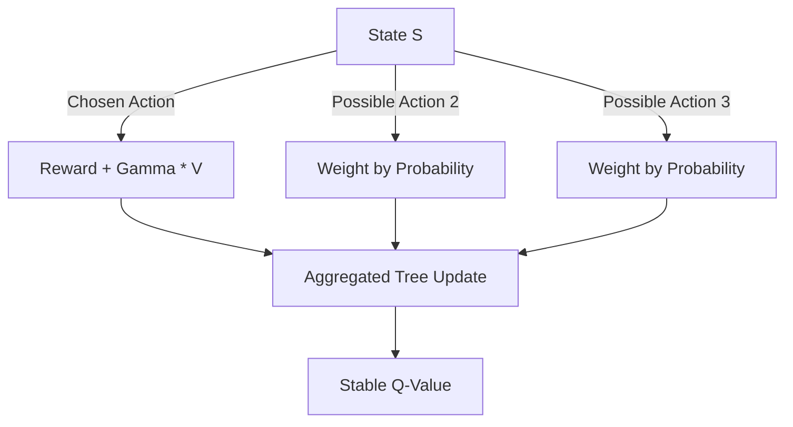

# Tree Backup Algorithm

🧠 **What does this do? (The Analogy)**
Think of a **Road Trip with multiple paths**. Most RL algorithms only learn from the **one** path you actually drove on. **Tree Backup** is like having a drone that flies over the whole neighborhood. It looks at the path you took, but it also looks at all the **Side Streets** you *could* have taken. It calculates the value of the trip by averaging the success of your actual path with the potential success of all those other side streets.

🔍 **Step-by-Step Explanation:**
1. **Multi-step Learning**: Like Q(λ), it looks many steps ahead.
2. **Probability Weighting**: Instead of just using the "Max" value, it uses the **Expected** value based on the policy's probabilities.
3. **Off-policy without cutting**: Unlike Watkins' Q(λ), it doesn't "cut" the trace if you take a non-greedy action. It just weights that action by its probability.
4. **Benefit**: It is more mathematically stable than Q-learning because it considers the "Full Tree" of possibilities at every step.

📊 **High-Level Design (HLD)**

✅ **Why use this?**
It is the foundation of **n-step Q-learning**. It is extremely useful when your agent is following a "Stochastic" (randomized) policy but you want to learn the absolute best strategy.

🌍 **Real-World Examples:**
1. **Traffic Light Coordination**: Learning the best timing for a light while considering all possible traffic patterns (side streets) that could occur.
2. **Online Auction Bidding**: Planning a sequence of bids while accounting for all possible counter-bids that other players might make.
