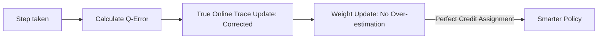

# True Online Sarsa(λ)

🧠 **What does this do? (The Analogy)**
Think of a **Painter with a drying brush**. In standard Sarsa(λ), the paint (Reward) is applied roughly to all past steps. **True Online Sarsa(λ)** is like a painter who constantly checks: "Is the paint still wet? Is the color exactly right?" It uses a much more precise mathematical formula to ensure that the reward is distributed **perfectly** across the entire path. It fixes the small "mathematical leaks" in the original Sarsa(λ) algorithm.

🔍 **Step-by-Step Explanation:**
1. **The Flaw in Classic Sarsa(λ)**: The old version could sometimes "over-update" or "under-update" states if they were visited multiple times in one loop.
2. **True Online traces**: It uses a slightly more complex update rule: $e \leftarrow e + (1 - \alpha e^T x) x$. 
3. **Accuracy**: It is mathematically identical to the "Forward View" (which is the perfect way to learn) but it can be calculated "Online" (as the agent moves).
4. **Benefit**: It is more stable and often learns faster than the original version, especially in large environments.

📊 **High-Level Design (HLD)**

✅ **Why use this?**
It is considered the "Definitive" version of linear eligibility traces. If you are using a simple agent (not a Deep Neural Network) and you want the best possible performance, you use **True Online Sarsa(λ)**.

🌍 **Real-World Examples:**
1. **Satellite Power Control**: Managing battery levels on a satellite where each decision must be mathematically perfect to avoid power failure over a 24-hour cycle.
2. **Industrial Boiler Control**: Precise temperature management where small "leaks" in the control logic could lead to massive energy waste over time.
