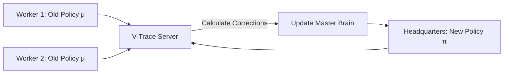

# V-Trace (The Distributed Corrective Engine)

🧠 **What does this do? (The Analogy)**
Think of a **Global Corporation** with 100 offices. The Headquarters (Learner) sends out a "Strategic Plan" (**Target Policy**) to all offices. But by the time the plan reaches a remote office in another country, it's 2 days old! The office works based on that **Old Plan** (**Behavior Policy**). When the HQ gets the results back, it uses **V-Trace** to say: "I see what you did, but I know it was based on the old plan. I will adjust your results so they fit the **New Plan** perfectly."

🔍 **Step-by-Step Explanation:**
1. **The Distributed Problem**: In large systems (like IMPALA), there is always a delay (lag) between the agent taking an action and the brain learning from it.
2. **Rho ($\rho$)**: An importance weight that compares the current brain's strategy to the strategy the agent was using when it took the action.
3. **Double Clipping**: 
   - **Clip Rho**: Stabilizes the Value Function estimate.
   - **Clip C**: Stabilizes the Policy Gradient estimate.
4. **Benefit**: Allows the system to run on 1,000+ CPU cores simultaneously without the brain getting "confused" by the lag.

📊 **High-Level Design (HLD)**

✅ **Why use this?**
It is the standard for **Extreme Scale RL**. If you want to train an AI on a massive cluster of servers (like DeepMind does for AlphaStar or AlphaGo), you use V-Trace to handle the millions of data points coming in from everywhere at different times.

🌍 **Real-World Examples:**
1. **Distributed Ad-Bidding**: Coordinating thousands of bidding bots across the global internet where network lag is unavoidable.
2. **Cloud Robotic Fleets**: Training thousands of different robots in different factories to share one single "Super-Brain" over the internet.
