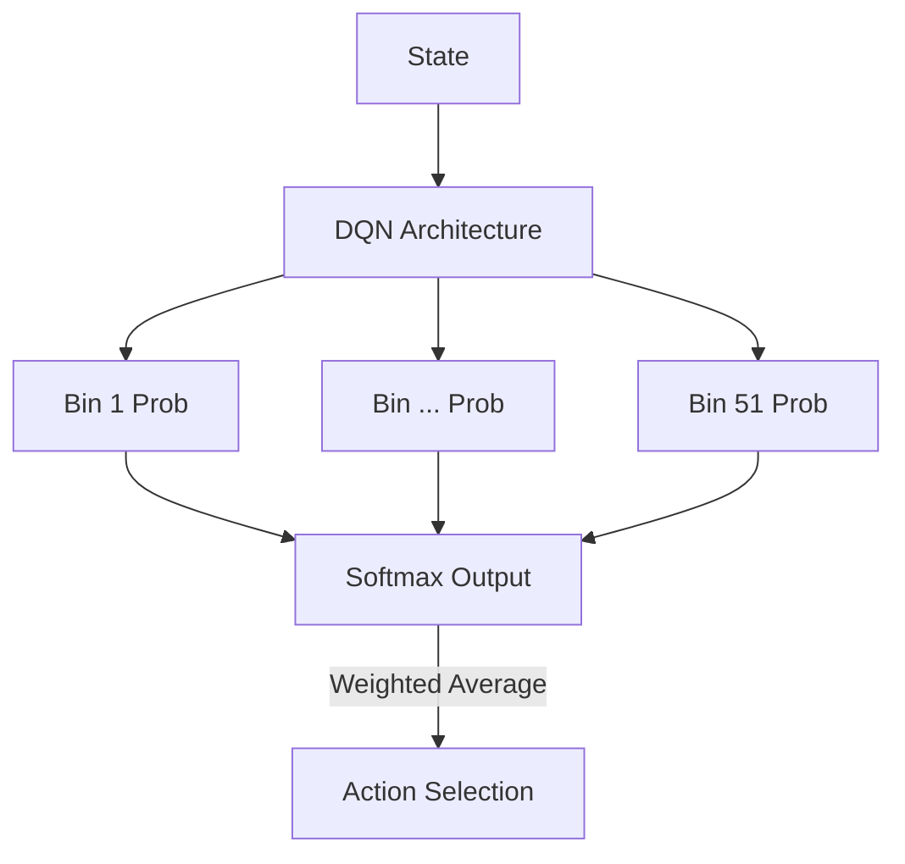

# C51 (Categorical DQN)

🧠 **What does this do? (The Analogy)**
Think of a **Plinko Board**. Standard RL only cares about where the ball *usually* lands (the average). **C51** cares about the entire board. It sets up **51 buckets** at the bottom of the board and learns the probability of the ball falling into each one. This allows the AI to understand that a "High Reward" might be rare, while a "Small Loss" might be very common.

🔍 **Step-by-Step Explanation:**
1. **Value Distributions**: Instead of a single Q-value, C51 learns a probability distribution over possible returns.
2. **Fixed Atoms**: It divides the possible reward range (e.g., -10 to +10) into 51 fixed "bins" or atoms.
3. **Categorical Projection**: When the agent gets a reward, it "shifts" the whole probability distribution and squashes it back into the 51 bins.
4. **The Benefit**: It provides the agent with a much richer "signal." Learning the shape of the reward distribution helps the agent understand the environment much better than just learning the average.

📊 **High-Level Design (HLD)**

✅ **Why use this?**
It was the first algorithm to prove that **Distributional RL** is significantly better than standard RL. It is the key ingredient in the famous "Rainbow DQN."

🌍 **Real-World Examples:**
1. **Supply Chain Risk**: Predicting the distribution of lead times for shipping—it's not just the "average" 5 days that matters, it's the "worst case" 20 days that breaks the business.
2. **Game AI (Poker)**: Understanding that a specific hand has a high probability of a small loss but a tiny probability of a massive win.
