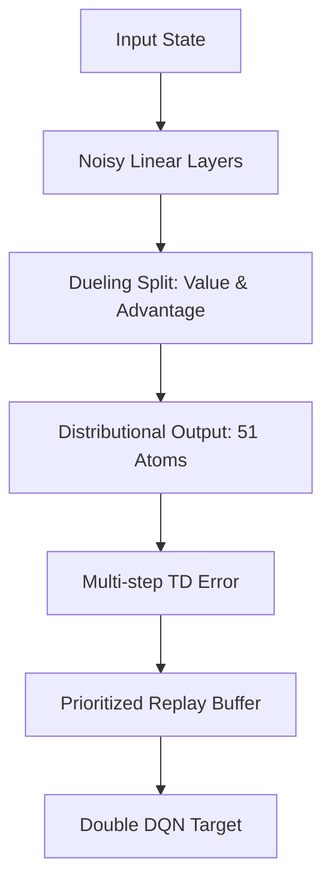

# Rainbow DQN (The Ultimate Ensemble)

🧠 **What does this do? (The Analogy)**
Think of a **Super-Doctor** who uses **every tool in the hospital** at the same time. One tool checks the heart (Double DQN), one checks the lungs (Dueling), one looks at the patient's history (Prioritized), and one looks at future risks (Multi-step). By combining all these specialized tools into one "Rainbow" procedure, the doctor becomes significantly more accurate than any individual specialist.

🔍 **Step-by-Step Explanation:**
The "Rainbow" is the combination of **7 breakthroughs** in DQN research:
1.  **Double DQN**: Prevents the AI from being "too optimistic" about its scores.
2.  **Prioritized Replay**: Focuses more on the "hard" lessons and ignores the "boring" ones.
3.  **Dueling Architecture**: Separates the value of the "State" from the value of the "Action."
4.  **Multi-step Returns**: Looks at the next 3-5 steps instead of just the very next one.
5.  **Distributional RL**: Models the "Range" of possible rewards instead of just the average.
6.  **Noisy Nets**: Adds "Mental Noise" to encourage exploration without needing random epsilon moves.
7.  **Categorical DQN**: Bins the rewards into a histogram for even better precision.

📊 **High-Level Design (HLD)**

✅ **Why use this?**
It is the **Final Boss** of value-based RL. If you have a discrete game (like Atari) and you want the absolute highest score possible, you use Rainbow. It beats every other DQN variation because it fixes every single known flaw in the original algorithm.

🌍 **Real-World Examples:**
1. **High-Frequency Trading**: Using all 7 tricks to handle the extreme speed and risk of the stock market.
2. **Space Mission Planning**: Coordinating complex satellite movements where you need the extreme precision and robustness that only Rainbow can provide.
