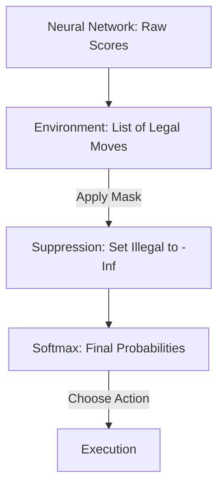

# Action Masking (Legal Move Enforcement)

🧠 **What does this do? (The Analogy)**
Think of a **Chess AI**. In Chess, you can only move a piece to a valid square. Standard RL is like a toddler trying to move a Pawn like a Queen; the environment then has to say "No, you can't do that" 1,000 times before the AI learns the rules. **Action Masking** is like **Removing the illegal squares** from the board entirely. The AI's brain physically cannot even *think* about an illegal move. This makes learning 100x faster because the AI only explores "Allowed" possibilities.

🔍 **Step-by-Step Explanation:**
1. **The Mask**: A binary list (e.g., $[1, 0, 1]$) where $1$ means the action is currently legal.
2. **Logit Suppression**: Before calculating the final probabilities (Softmax), we set the "Forbidden" actions to negative infinity ($-\infty$).
3. **Zero Probability**: When the math is finished, the probability of an illegal action becomes exactly $0.000\%$.
4. **Benefit**: The agent never "wastes" a step trying to do something impossible (like buying a stock with $\$0$ in the bank).

📊 **High-Level Design (HLD)**

✅ **Why use this?**
It is standard for **Strategy Games** and **Business Logic**. If an AI is managing a supply chain, it shouldn't try to "Ship items from a warehouse that is empty." Action Masking enforces the "Rules of the Business" directly into the AI's neural network.

🌍 **Real-World Examples:**
1. **RTS Games (StarCraft/Dota)**: Ensuring the AI doesn't try to "Cast a Spell" when it doesn't have enough mana.
2. **Financial Trading**: Ensuring the AI doesn't try to "Sell" a stock it doesn't own (preventing illegal naked shorting).
