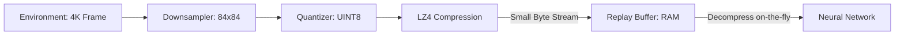

# Experience Compression (Memory Efficient RL)

🧠 **What does this do? (The Analogy)**
Think of a **Photographer with a small memory card**. If they take every photo in 4K RAW format, the card is full in 10 minutes. If they convert the photos to **JPEGs**, they can store 1,000 times more photos. **Experience Compression** is the JPEG of RL. It "squashes" the agent's memories (frames) so it can remember 1,000,000 steps of experience on a standard laptop instead of needing a $10,000 server.

🔍 **Step-by-Step Explanation:**
1. **Quantization**: Converting high-precision numbers (float64) into low-precision numbers (uint8 or even 1-bit binary).
2. **Delta Encoding**: Instead of storing the whole image, just store the "Difference" from the previous image. Since most of the screen doesn't change, this saves massive space.
3. **Lossy vs. Lossless**: Choosing a compression level that saves space but still lets the AI "see" enough to learn.
4. **Benefit**: Larger replay buffers = better learning. Compression allows you to use a buffer that is 10x larger than what your RAM normally allows.

📊 **High-Level Design (HLD)**

✅ **Why use this?**
It is essential for **Edge Computing** and **Mobile AI**. If you want to train an RL agent on a smartphone or a small Raspberry Pi, you MUST compress the experience buffer to avoid crashing the device.

🌍 **Real-World Examples:**
1. **Mobile Gaming Bots**: Training an AI directly on a phone by compressing the screen recordings it uses for learning.
2. **Satellite AI**: Storing weeks of orbital observations in a tiny onboard memory buffer by compressing the latent representations.
