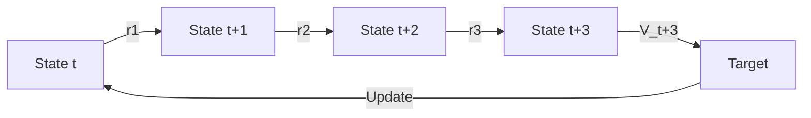

# N-Step Returns (Multi-Step Learning)

🧠 **What does this do? (The Analogy)**
Think of a **Distant Lighthouse**. Standard RL is like someone walking with a tiny flashlight that only shows the next step. They have to wait to take a step before they know if it was good. **N-Step Returns** is like having a much stronger flashlight that shows the next **5 steps**. You can see the goal much sooner and don't have to wait as long to know if your path is correct.

🔍 **Step-by-Step Explanation:**
1. **The 1-Step (TD)**: You look at the current reward and the next state's value. $G_t = r_t + \gamma V(s_{t+1})$.
2. **The N-Step**: You sum up the rewards for $N$ steps and then look at the value of the final state.
3. **The Formula**: $G_{t:t+n} = r_t + \gamma r_{t+1} + \dots + \gamma^{n-1} r_{t+n-1} + \gamma^n V(s_{t+n})$.
4. **The Benefit**: It propagates rewards backward much faster. If you reach a goal in 100 steps, a 1-step agent needs 100 updates to understand the first step. a 5-step agent only needs 20.

📊 **High-Level Design (HLD)**

✅ **Why use this?**
It significantly speeds up training in environments where rewards are far apart. However, you have to be careful: if $N$ is too large, the "variance" increases because many random things can happen over many steps.

🌍 **Real-World Examples:**
1. **Supply Chain Management**: Looking ahead 7 days of shipments to decide today's warehouse order, rather than just looking at tomorrow's demand.
2. **Elevator Control**: Predicting the next 3 floor requests to decide which floor to park at, rather than just reacting to the single next button press.
