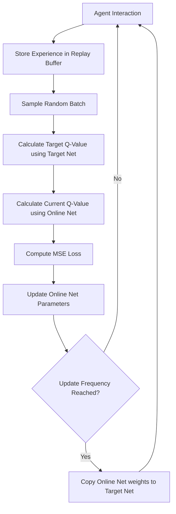

# Deep Q-Networks (DQN) Deep Dive

## Introduction
Deep Q-Networks (DQN) represent a breakthrough in RL, where **Deep Learning** is combined with **Q-Learning**. This allows the agent to handle large or continuous state spaces (like pixels in a video game) that a standard Q-Table cannot manage.

## Core Concepts

### 1. Function Approximation
Instead of a table, we use a **Neural Network** to approximate the Q-values: $Q(s, a; \theta) \approx Q^*(s, a)$.

### 2. Experience Replay
To break the correlation between consecutive samples and stabilize training, we store experiences $(s, a, r, s', done)$ in a **Replay Buffer** and sample random batches for training.

### 3. Target Network
We use two networks:
- **Online Network**: Updated every step.
- **Target Network**: A delayed copy of the Online Network used to calculate targets. This prevents the "moving target" problem and makes training more stable.

## High-Level Design (HLD)

## Why DQN is Better?
- **Scalability**: Can handle complex inputs (images, high-dimensional sensors).
- **Generalization**: Learns patterns rather than just specific state-action pairs.
- **Stability**: Techniques like Replay Buffer and Target Networks make deep RL viable.

### Pros and Cons
| Pros | Cons |
| :--- | :--- |
| Handles large state spaces | Only works for **Discrete** action spaces |
| More efficient than pure Q-learning | Can suffer from overestimation bias |
| Highly extensible (Double DQN, Dueling DQN) | Training can be unstable without tuning |

---

## Interview Questions (Q&A)

**Q: Why do we need a Target Network in DQN?**
A: Because in the Q-learning update, the target depends on the same weights we are updating. This causes a "chasing your own tail" effect. The Target Network provides a stable benchmark for a few hundred steps.

**Q: What is the purpose of the Replay Buffer?**
A: 1) It allows for better data efficiency by reusing samples. 2) It breaks the temporal correlation between consecutive steps, which is critical for Stochastic Gradient Descent.

**Q: Can DQN work for continuous actions (e.g., steering a car 0.5 degrees)?**
A: No. DQN requires taking the `argmax` over actions. For continuous spaces, we use algorithms like **PPO** or **SAC**.

---
*Created for Reinforcement Learning DQN Learning Path.*
