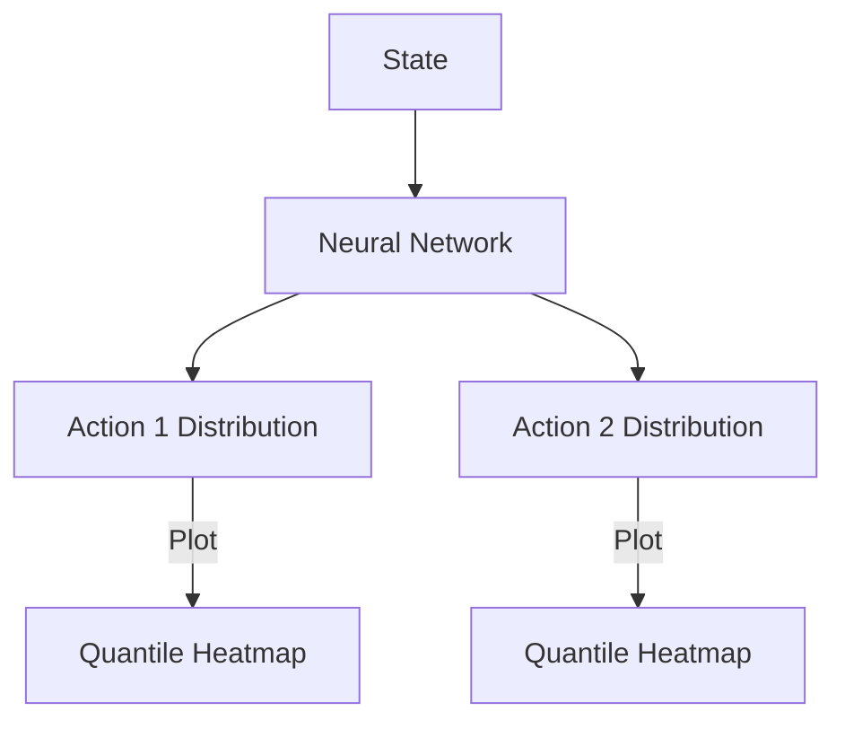

# Distributional Reinforcement Learning (QR-DQN)

🧠 **What does this do? (The Analogy)**
Think of a **Weather Forecast**. Standard RL is like a forecast that only says: "The average temperature will be 20°C." Distributional RL is a forecast that says: "There is a 10% chance of 5°C, an 80% chance of 20°C, and a 10% chance of 35°C." It understands **risk and uncertainty**.

🔍 **Step-by-Step Explanation:**
1. **From Mean to Distribution**: Standard DQN learns the *expected* value (mean). Distributional RL learns the *probability distribution* of future rewards.
2. **Quantiles**: Instead of a bell curve, it learns specific "checkpoints" (e.g., 10th percentile, 50th percentile, etc.).
3. **The Benefit**: This allows the agent to distinguish between a "stable" reward and a "high-risk/high-reward" gamble.
4. **Faster Learning**: Paradoxically, learning the full distribution often helps the agent learn the mean value much faster and more accurately.

📊 **High-Level Design (HLD)**

✅ **Why use this?**
It is much more robust to noise and randomness. In environments with lots of "luck" (like poker or the stock market), understanding the distribution is critical for avoiding catastrophic losses.

🌍 **Real-World Examples:**
1. **Autonomous Driving**: Evaluating the "worst-case scenario" distribution for a lane change to ensure maximum safety.
2. **Dynamic Pricing**: Predicting the distribution of customer demand to set prices that maximize profit while minimizing the risk of zero sales.
