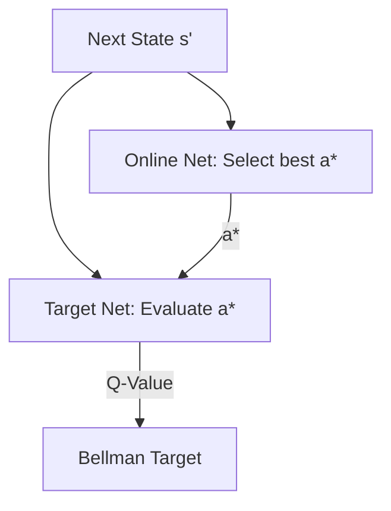

# Double Deep Q-Networks (Double DQN)

🧠 **What does this do? (The Analogy)**
Think of **two friends** judging a talent show. If one person judges alone (Standard DQN), they might get overly excited and give a 10/10 to someone who is just "okay" (Overestimation). In Double DQN, one friend **selects** the winner, but the other friend **decides the score**. This way, if one friend is biased, the other provides a reality check.

🔍 **Step-by-Step Explanation:**
1. **The Problem (Overestimation)**: Standard DQN always takes the `max` of Q-values. If Q-values have random noise, the `max` will always pick the "noisiest" high value, making the agent too optimistic.
2. **Selection (Online Net)**: Use the main network to decide which action is the best: $a^* = \text{argmax } Q_{online}(s', a)$.
3. **Evaluation (Target Net)**: Use the target network to find the value of that specific action: $Target = R + \gamma Q_{target}(s', a^*)$.
4. **The Benefit**: This decouple logic significantly reduces overestimation and leads to much more stable learning.

📊 **High-Level Design (HLD)**

✅ **Why use this?**
It is a simple "drop-in" fix that almost always improves the performance of any DQN-based agent. It prevents the agent from "hyping up" mediocre actions.

🌍 **Real-World Examples:**
1. **Inventory Management**: Preventing an AI from ordering too much stock because it overestimates the potential profit of a specific item.
2. **Pathfinding for Logistics**: Ensuring a delivery drone doesn't pick a "risky" shortcut just because it overestimated the time saved.
