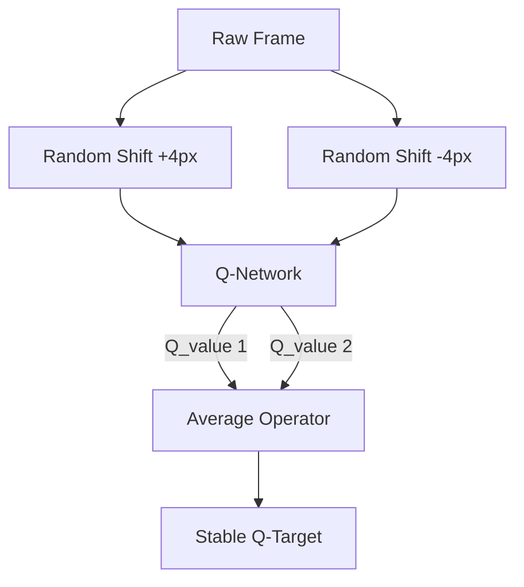

# DrQ (Data Regularized Q-Learning)

🧠 **What does this do? (The Analogy)**
Think of an **Art Student studying a painting**. If they only look at the painting from exactly 2 meters away, they might miss the brushstrokes. **DrQ** is like looking at the painting while **Squinting**, **Tilting your head**, and **Moving closer**. By averaging what you see across these different "views," you get a much more stable and accurate understanding of the art.

🔍 **Step-by-Step Explanation:**
1. **Simple Augmentation**: Take an input image and shift it by just 4 pixels (random crop).
2. **Double Evaluation**: Pass the original image AND the shifted image through the Q-network.
3. **Averaging**: Use the **Average** of these two Q-values for your training update.
4. **Why it works**: It forces the AI to ignore "pixel noise." If shifting the image 4 pixels changes the AI's answer, it knows its answer is unstable and fixes it.

📊 **High-Level Design (HLD)**

✅ **Why use this?**
It is incredibly simple to implement but performs as well as (or better than) much more complex algorithms like CURL. It is the "Best Bang for your Buck" when working with image-based RL.

🌍 **Real-World Examples:**
1. **Visual Quality Control**: A robot inspecting parts where the camera might be slightly shaky. DrQ makes the AI immune to that shaking.
2. **Autonomous Drones**: Flying in changing lighting conditions—DrQ helps the AI ignore shadows and focus on the actual obstacles.
