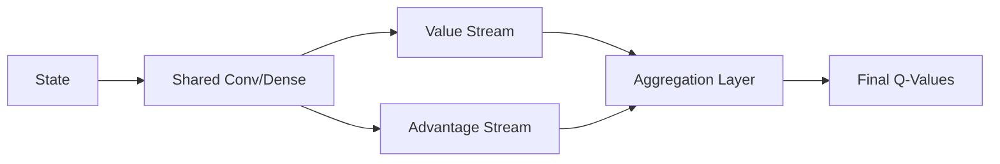

# Dueling Deep Q-Networks (Dueling DQN)

🧠 **What does this do? (The Analogy)**
Think of a **Driver** and a **Road Inspector**. In standard DQN, one network does everything. In Dueling DQN, we split the brain into two parts:
1. **The Road Inspector (Value)**: Judges if the road is safe or dangerous, regardless of what the car does.
2. **The Driver (Advantage)**: Decides which specific move (turn left or right) is better at this moment.
By separating these, the AI can learn that a state is "bad" (like a cliff edge) even if it hasn't tried every possible action there yet.

🔍 **Step-by-Step Explanation:**
1. **Value Stream ($V(s)$)**:
   - Outputs a single number representing the value of being in state $s$.
2. **Advantage Stream ($A(s, a)$)**:
   - Outputs a value for each action, representing how much better it is than the average action.
3. **The Aggregation Layer**:
   - $Q(s, a) = V(s) + (A(s, a) - \frac{1}{|A|} \sum A(s, a'))$
   - This formula combines them while keeping the advantages centered.

📊 **High-Level Design (HLD)**

✅ **Why use this?**
It is much more efficient in states where actions don't affect the environment much. For example, in a racing game, if there are no cars around, "Value" (position on track) is all that matters, and "Advantage" (minor steering) is secondary.

🌍 **Real-World Examples:**
1. **Financial Trading**: The "Value" is the market trend (Bullish/Bearish), while "Advantage" is the specific buy/sell decision.
2. **Video Streaming (Buffering)**: "Value" is the network stability, while "Advantage" is the specific bitrate selection.
