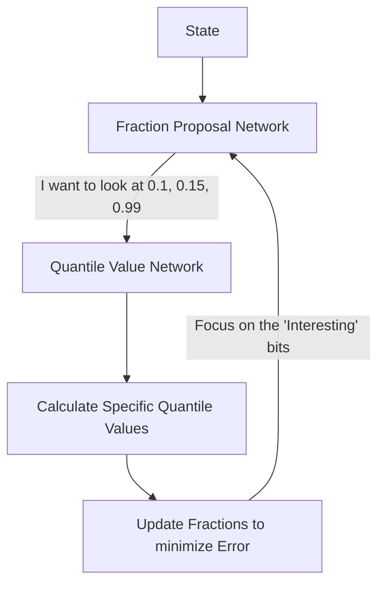

# FQF (Fully Parameterized Quantile Function)

🧠 **What does this do? (The Analogy)**
Think of a **Photographer taking a picture**. 
- **QR-DQN** is like a cheap camera with a fixed focus (Fixed quantiles). 
- **IQN** is like a camera that takes random pictures and hopes one is in focus (Random quantiles). 
- **FQF** is like a **Professional Photographer** who manually focuses the lens on the most important part of the scene (Adaptive quantiles). 
**FQF** learns a second AI (The Fraction Proposal Network) whose only job is to say: "Don't waste time looking at the boring parts of the reward distribution. Focus all your attention on the 1% chance of a huge success!"

🔍 **Step-by-Step Explanation:**
1. **Fraction Proposal Network (FPN)**: An auxiliary neural network that outputs the "boundaries" of the quantiles.
2. **Wasserstein Distance**: The AI is rewarded for picking boundaries that minimize the distance between its "Guess" and the "Reality" of the world.
3. **Adaptive Resolution**: In areas where the reward is simple, FQF uses broad, wide quantiles. In areas where the reward is complex/dangerous, it uses many tiny, precise quantiles.
4. **Benefit**: It is the **Most Accurate** distributional RL algorithm. it finds patterns that both IQN and QR-DQN miss.

📊 **High-Level Design (HLD)**

✅ **Why use this?**
It is the best choice for **High-Stake Decisions**. If you are managing a nuclear reactor or a high-speed trading bot, you don't care about "average luck." You care about the exact details of the "extreme events." FQF gives you the maximum resolution for those events.

🌍 **Real-World Examples:**
1. **Flash Crash Prevention**: An AI that "focuses" its attention on the exact 0.1% of market conditions that cause a crash.
2. **Precision Surgery**: Focusing on the exact 0.5% of "unlikely" nerve positions during an automated procedure.
3. **Self-Driving Weather Safety**: Focusing on the "tail end" of stopping distances during a rare black-ice event.
