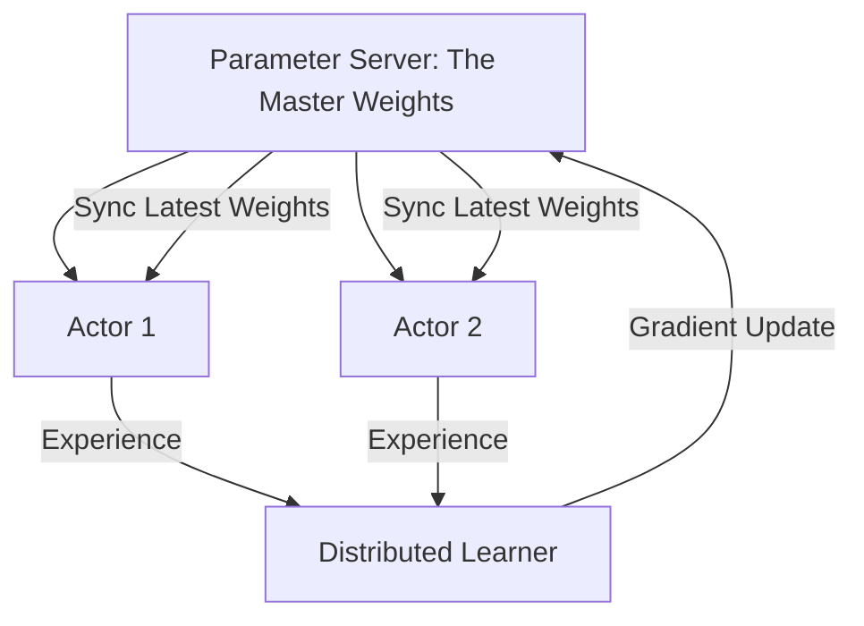

# Gorila (Massively Distributed DQN)

🧠 **What does this do? (The Analogy)**
Think of a **Giant Library being built by 1,000 workers**. 
- Each worker (The Actor) goes out to different parts of the city and brings back one book. 
- A central "Librarian" (The Parameter Server) takes all the books and organizes them on the shelves. 
- Whenever a worker wants to learn something new, they go to the library and "Copy" the latest knowledge from the shelves. 
- **Gorila** was the first architecture to prove that if you have enough workers (Computers), you can train an AI on almost anything in a few hours.

🔍 **Step-by-Step Explanation:**
1. **The Actors**: Thousands of CPU nodes running different copies of the game environment.
2. **The Parameter Server**: A central node that holds the master "Weights" of the neural network.
3. **The Learner**: A high-performance node that takes data from the actors and calculates the math.
4. **Asynchronous Updates**: Unlike other systems, Gorila doesn't wait for everyone to finish. If one actor finds a "book," it sends it immediately.
5. **Benefit**: It was the first system to allow RL to scale across **Thousands of Computers** simultaneously.

📊 **High-Level Design (HLD)**

✅ **Why use this?**
It is the ancestor of **IMPALA and Seed RL**. If you are building a system that needs to process a billion frames of data every day, Gorila is the classic architecture for distributing that work.

🌍 **Real-World Examples:**
1. **Google AI Research**: Used to win the first big Atari competitions by scaling across Google's massive data centers.
2. **Smart Grid Optimization**: Coordinating thousands of individual batteries across a city to balance the power grid.
