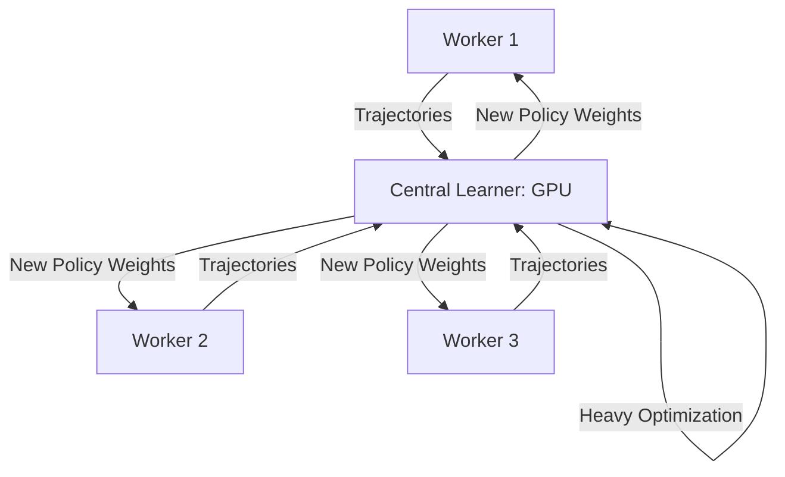

# IMPALA (Importance Weighted Actor-Learner Architecture)

🧠 **What does this do? (The Analogy)**
Think of a **Central Intelligence Agency (CIA)**. There are 1,000 **Field Agents (Actors)** all over the world. They don't have time to "think" or "learn." They just record everything they see and send the video tapes back to the **HQ Analysts (Learners)**. The HQ Analysts look at all the tapes from all 1,000 agents, find the patterns, and then send a new manual out to everyone. Because the Analysts have a giant supercomputer, they can learn much faster than a single agent in the field.

🔍 **Step-by-Step Explanation:**
1. **Actor-Learner Separation**: Unlike A3C, the agents (Actors) do **ZERO** math. They just play the game and send data.
2. **High Throughput**: Because actors don't have to wait for the brain to update, they can collect data at incredible speeds (millions of frames per second).
3. **The Learner**: A single, massive GPU server that processes data from hundreds of CPU workers simultaneously.
4. **V-Trace Integration**: Uses V-Trace to handle the fact that by the time an agent's "tape" reaches HQ, the HQ strategy has already improved.

📊 **High-Level Design (HLD)**

✅ **Why use this?**
It is the gold standard for **Multi-Task Learning**. If you want an AI that can play 57 different games at the same time, IMPALA is the architecture you use. It is significantly more efficient than A3C and much easier to scale to large clusters.

🌍 **Real-World Examples:**
1. **Large Scale NLP**: Training conversational bots across thousands of user interactions in real-time.
2. **Self-Driving Car Simulation**: Running 50,000 virtual cars in a digital city to learn how to handle rare accidents, all contributing to one master "Safety Brain."
