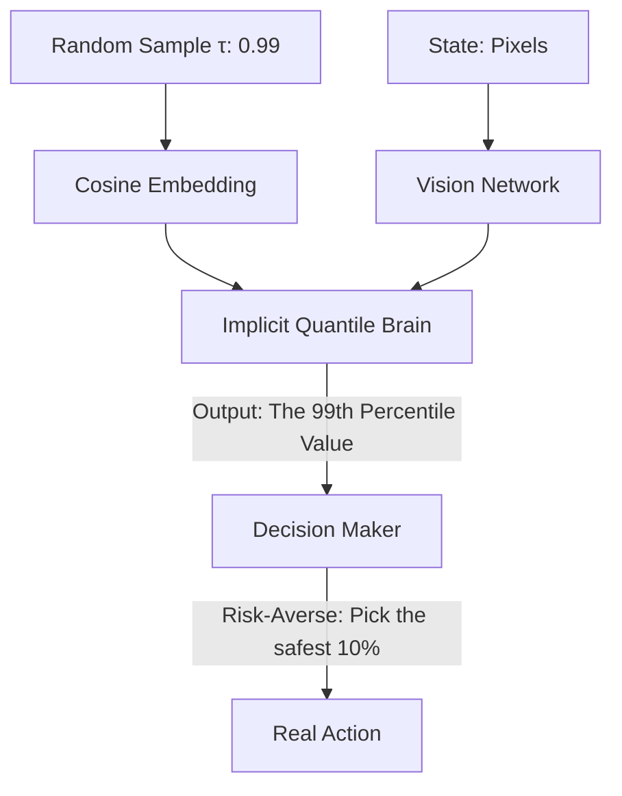

# IQN (Implicit Quantile Network)

🧠 **What does this do? (The Analogy)**
Think of a **Person drawing a curve with a Pencil**. 
- **QR-DQN** is like a person who can only draw 5 fixed bars (A Histogram). 
- **IQN** is like a person who has a **Smooth Pen**. They can draw any curve, no matter how complex it is. 
- **IQN** doesn't use "Fixed Slots." Instead, it uses a random number generator (Sampling) to "ask" the neural network: "What is the 25th percentile of the reward? What is the 99th percentile?" 
Because it can answer **any** question about the reward distribution, it is the most powerful "Distributional" AI ever built.

🔍 **Step-by-Step Explanation:**
1. **Implicit Representation**: Instead of outputting 5 numbers, the network takes a random sample $\tau \in [0,1]$ as an **Input**.
2. **Feature Embedding**: The random sample $\tau$ is converted into a high-dimensional vector using Cosine waves.
3. **Infinite Quantiles**: By sampling many $\tau$'s, you can perfectly reconstruct the entire "Shape" of the luck and risk in the environment.
4. **Benefit**: It is more **Memory Efficient** than QR-DQN and much more accurate. It can represent "Thin Tails" (rare disasters) much better.

📊 **High-Level Design (HLD)**

✅ **Why use this?**
It is the **State-of-the-Art** for DQN-style agents. If you are building an AI for a world with massive "Swings" in luck (like Poker or a volatile stock market), IQN is the most sophisticated tool available.

🌍 **Real-World Examples:**
1. **Algorithmic Trading**: Using the 95th percentile (Value-at-Risk) to decide when to sell a stock to prevent a bankruptcy-level loss.
2. **Precision Manufacturing**: Modeling the "Distribution" of machine errors so that the AI only takes actions that have a 99.9% chance of succeeding.
3. **Competitive Esports**: Training an AI that understands when it needs to "Take a Gamble" (High Variance) because it is currently losing.
