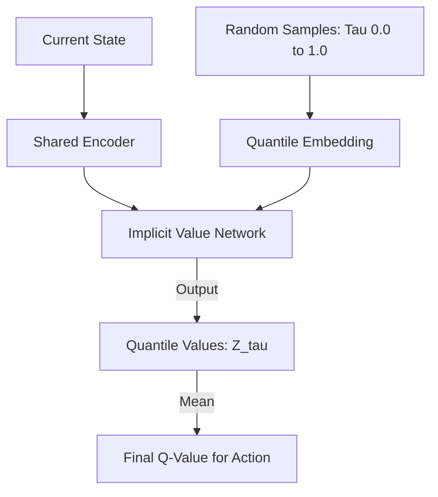

# IQN (Implicit Quantile Networks)

🧠 **What does this do? (The Analogy)**
Think of a **Weather Report**. 
- Standard DQN says: "It will be 25 degrees." 
- C51 (Categorical RL) says: "There is a 10% chance of 20 degrees, 80% chance of 25, and 10% chance of 30." 
- **IQN** is like a **Laser-Precise Scanner**. You can ask it: "What is the temperature at exactly the 73.5% point of probability?" 
It models the **Entire Infinite Distribution** of rewards. It doesn't just guess a few points; it understands the full "Shape of Risk" from 0% to 100%.

🔍 **Step-by-Step Explanation:**
1. **The Tau ($\tau$)**: A random number between 0 and 1 representing a "Quantile" (percentile).
2. **Quantile Embedding**: The $\tau$ is turned into a mathematical code (using Cosine functions) so the neural network can understand it.
3. **The Mapping**: The network takes a State AND a $\tau$ and predicts the Value at that exact percentile.
4. **Benefit**: Because it is "Implicit," you can sample as many points as you want. If the situation is simple, you sample 8 points. If the situation is a dangerous gamble, you can sample 2,000 points to be 100% sure of the risk.

📊 **High-Level Design (HLD)**

✅ **Why use this?**
It is the current **State-of-the-Art for Discrete RL**. It outperforms the already-powerful Rainbow DQN in almost every test. If you want an agent that is extremely smart about **Risk and Probability**, IQN is the absolute best choice.

🌍 **Real-World Examples:**
1. **Stock Trading AI**: Modeling the "Long Tail" risk—predicting that 1% chance of a market crash so the agent can stay safe.
2. **Medical Diagnosis**: Predicting not just the "Average" recovery time, but the full distribution of how different patients might react to a drug.
3. **Insurance Pricing**: Calculating the "Value at Risk" for complex insurance contracts.
