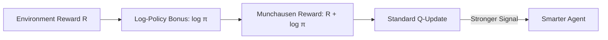

# Munchausen RL (Self-Bootstrapping)

🧠 **What does this do? (The Analogy)**
Think of the legend of **Baron Munchausen**, who allegedly pulled himself out of a swamp by **pulling on his own hair**. **Munchausen RL** is an AI that "pulls itself up" by adding its own **Confidence** into the reward signal. 
If the AI thinks: "I'm 90% sure that turning left is the right move," it gives itself a **Small Bonus Reward** for being confident. This creates a "Self-Fulfilling Prophecy" that helps the AI learn much faster and stay more stable.

🔍 **Step-by-Step Explanation:**
1. **The Log-Policy Penalty**: It adds the term $\alpha \tau \ln \pi(a|s)$ to the reward.
2. **Implicit Entropy**: This is similar to the entropy bonus in SAC, but it is applied directly to the **Q-value** calculation.
3. **Consistency**: It ensures that the agent's Q-values are mathematically "consistent" with its policy.
4. **Benefit**: It is a "Zero-Cost" upgrade. You don't need a new network; you just change one line of math in your DQN or IQN algorithm, and it suddenly becomes much more robust.

📊 **High-Level Design (HLD)**

✅ **Why use this?**
It is one of the "Hidden Gems" of RL research. In 2020, it was shown that adding this one line of math to a standard DQN made it outperform almost every other algorithm on the Atari benchmark.

🌍 **Real-World Examples:**
1. **Financial Prediction**: Using Munchausen to make an AI more confident in "Steady Growth" patterns while ignoring random daily noise.
2. **Video Games**: Creating NPCs that have more "Consistent" personalities because they get rewarded for sticking to their own strategy.
