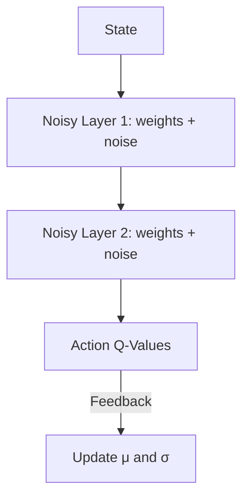

# Noisy Networks for Exploration

🧠 **What does this do? (The Analogy)**
Think of an **Artist with a shaky hand**. Standard exploration (Epsilon-Greedy) is like an artist who draws perfectly 90% of the time, but occasionally makes a completely random scribble. **Noisy Networks** is like an artist whose hand is **always slightly trembling**. Every single line is unique and exploratory, but it still follows a meaningful pattern. The agent explores by being "consistently random" in its internal thoughts.

🔍 **Step-by-Step Explanation:**
1. **The Problem with Epsilon-Greedy**: Randomly picking an action (Epsilon) is very "jittery" and often kills the agent's momentum in complex tasks.
2. **Parameter Noise**: Instead of making the *output* random, we make the **weights** of the neural network random.
3. **Noisy Layers**: Every weight $W$ becomes $\mu + \sigma \cdot \epsilon$, where $\epsilon$ is random noise.
4. **Learning the Noise**: The agent learns how much noise it needs. Over time, it can choose to reduce the noise ($\sigma$) to 0 when it is confident, effectively "turning off" exploration automatically.

📊 **High-Level Design (HLD)**

✅ **Why use this?**
It leads to much deeper exploration. Because the noise is consistent throughout an entire episode, the agent can commit to a long, complex sequence of exploratory actions, which is impossible with simple Epsilon-Greedy.

🌍 **Real-World Examples:**
1. **Exploration in Dark Environments**: A robot navigating a pitch-black cave can't just move randomly; it needs a consistent "exploratory gait" to find its way out.
2. **Creative Content Generation**: An AI writing a story needs "consistent randomness" to develop unique plot points without becoming nonsensical.
