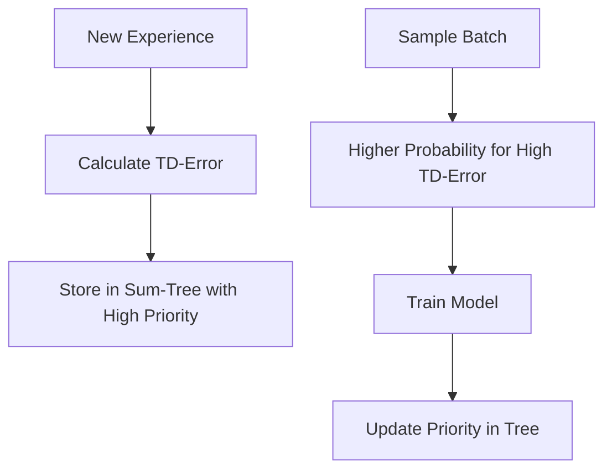

# Prioritized Experience Replay (PER)

🧠 **What does this do? (The Analogy)**
Think of a **Student studying for an exam**. If the student just reads the textbook page-by-page (Standard Replay), they waste time on things they already know. In Prioritized Replay, the student focuses on the **questions they got wrong**. They spend more time on the "difficult" parts to learn faster.

🔍 **Step-by-Step Explanation:**
1. **The TD-Error**: This is the "surprise" factor. It is the difference between what the agent expected and what actually happened.
2. **Priority ($P_i$)**: We set the priority of a memory based on its TD-error. $|Reward + \gamma Q(s', a') - Q(s, a)|$.
3. **Sampling Probability**: The probability of picking a memory is $P(i) = \frac{p_i^\alpha}{\sum_k p_k^\alpha}$.
4. **The Benefit**: The agent "re-lives" its most important mistakes and successes more frequently, leading to much faster convergence.

📊 **High-Level Design (HLD)**

✅ **Why use this?**
Standard Experience Replay samples uniformly, which is inefficient. PER ensures that the "rare but important" events (like reaching a goal for the first time) are not forgotten in a sea of boring data.

🌍 **Real-World Examples:**
1. **Fraud Detection**: Prioritizing the study of "suspicious" transactions rather than checking every normal purchase.
2. **Emergency Response AI**: Learning more from rare "Critical Failures" (like a sensor breaking) than from hours of normal operation.
