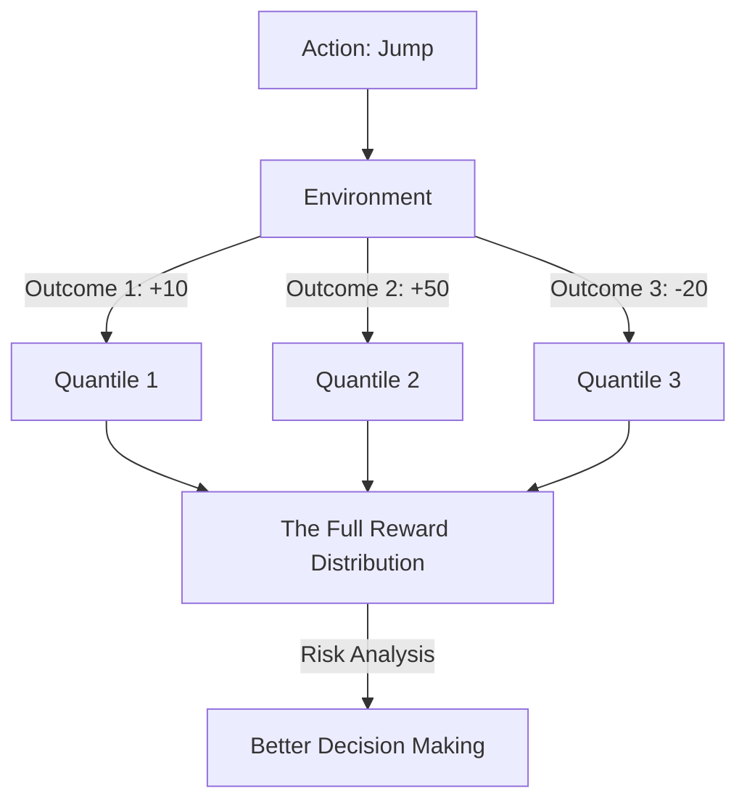

# QR-DQN (Quantile Regression DQN)

🧠 **What does this do? (The Analogy)**
Think of a **Weather Reporter**. 
- A normal AI (DQN) says: "The average temperature today will be 20°C." 
- **QR-DQN** says: "There is a 10% chance it's 10°C, a 50% chance it's 20°C, and a 40% chance it's 30°C." 
**QR-DQN** is "Distributional." It doesn't just look at the **Average** result; it looks at the **Whole Spectrum** of possibilities. This makes it much smarter at handling "Luck" and "Risk." If an action has a high average but a 1% chance of a disaster, QR-DQN can see that danger clearly.

🔍 **Step-by-Step Explanation:**
1. **Quantiles**: Instead of one number, the AI learns $N$ different "Bars" of a histogram.
2. **Distributional Bellman Equation**: The AI updates the entire "Shape" of the histogram every time it takes a step.
3. **Quantile Regression**: A specific type of math that allows the AI to "Place the bars" in the right spots to match the real-world data.
4. **Benefit**: It is significantly more stable and reaches **higher scores** on Atari and other games because it doesn't get confused by "Noisy" rewards.

📊 **High-Level Design (HLD)**

✅ **Why use this?**
It is the gold standard for **High-Performance Game AI**. It is one of the "Rainbow" components that made DQN unbeatable. If you want an agent that is "Self-Aware" of its own luck, QR-DQN is the architecture.

🌍 **Real-World Examples:**
1. **Stock Trading**: Predicting not just the "Average" price of a stock, but the "Worst-case" and "Best-case" scenarios to manage risk.
2. **Autonomous Braking**: Realizing there is a 5% chance the road is icy, so the "Distribution" of stopping distances is very wide, and the car should slow down early.
3. **Inventory Management**: Predicting a "Distribution" of customer demand to ensure the store never runs out of products during a "Peak" day.
