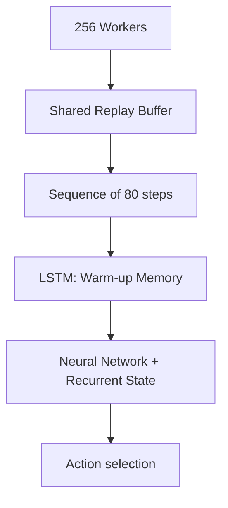

# R2D2 (Recurrent Replay Distributed DQN)

🧠 **What does this do? (The Analogy)**
Think of a **Detective solving a cold case**. Most RL agents (DQN) only see what's in front of them right now. **R2D2** has a **Notebook** (LSTM/Recurrent Memory). It remembers what it saw 100 steps ago. If it sees a locked door, it "remembers" that it found a key 5 rooms back. It combines this **Memory** with a **Massive Team** of 256 parallel workers to solve games that are impossible for standard AI.

🔍 **Step-by-Step Explanation:**
1. **Recurrent State (h)**: The agent maintains a hidden state that represents its memory.
2. **Burn-In Phase**: When sampling from the replay buffer, the agent "re-lives" the first 40 steps to "warm up" its memory before it starts training.
3. **Distributed Architecture**: Hundreds of workers collect data, while one central learner updates the weights.
4. **Sequence Replay**: It doesn't store single steps; it stores entire **Sequences** of 80 steps to preserve the context of the memory.

📊 **High-Level Design (HLD)**

✅ **Why use this?**
It was the first algorithm to solve the "Memory-Heavy" Atari games like **Montezuma's Revenge**. It is the ultimate tool for tasks where the current observation is not enough to make a decision (POMDPs).

🌍 **Real-World Examples:**
1. **Financial Market Analysis**: An AI that remembers the price trends of the last week to make a trade today, rather than just looking at the current price.
2. **Hospital Monitoring**: An AI that remembers a patient's vitals from 4 hours ago to detect a slow, dangerous trend that a "1-step" AI would miss.
