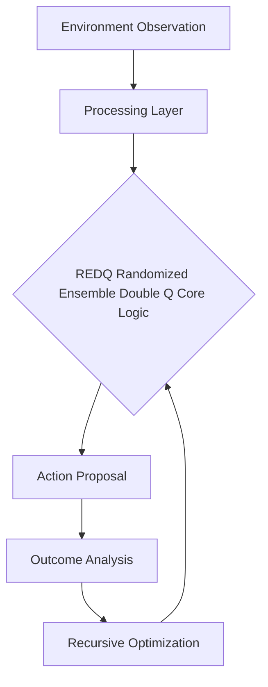

# REDQ Randomized Ensemble Double Q

## 🧠 The Analogy
**A student who asks 10 different teachers for the answer and only believes the most 'Pessimistic' two to avoid overconfidence.**

## 🚀 Overview
REDQ uses an ensemble of Q-functions and takes a subset to reduce overestimation bias in SAC-style algorithms.

## 🔍 Key Concepts
1. **Optimization**: Maximizing long-term reward through specific architectural choices.
2. **Stability**: Ensuring the agent doesn't 'forget' or 'diverge' during training.
3. **Efficiency**: Reducing the number of samples needed to reach expert performance.

## 📊 High-Level Design (HLD)

## ⚖️ Pros and Cons
| Pros | Cons |
| :--- | :--- |
| Extremely sample efficient | High compute cost per update |

---
*Created for the Reinforcement Learning Encyclopedia Project.*
