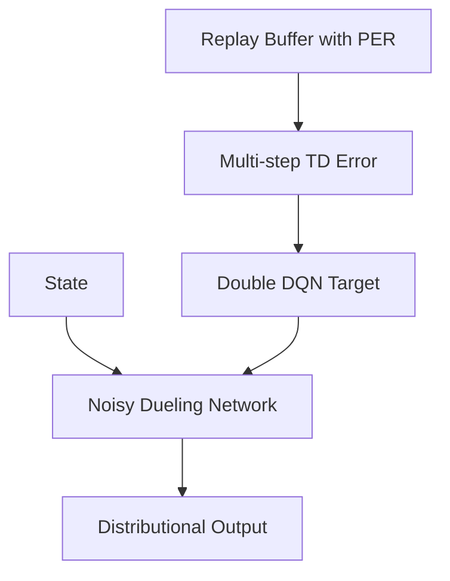

# Rainbow DQN (The Integrated Model)

🧠 **What does this do? (The Analogy)**
Think of a **Supercar**. Standard DQN is a basic engine. Dueling DQN is an aerodynamic body. PER is a high-performance fuel. **Rainbow DQN** is what happens when you take every single "upgrade" ever invented for DQN and put them into one single car. It is the most powerful version of the Deep Q-Network family.

🔍 **The 6 Ingredients of the Rainbow:**
1. **Double DQN**: Fixes overestimation of rewards.
2. **Dueling DQN**: Separates "How good is the state" from "How good is the action."
3. **Prioritized Replay (PER)**: Learns more from important/rare experiences.
4. **Noisy Networks**: Learns how to explore without needing "Epsilon."
5. **Distributional RL**: Learns the full probability of rewards, not just the average.
6. **Multi-Step Learning**: Looks ahead 3-5 steps instead of just 1.

📊 **High-Level Design (HLD)**

✅ **Why use this?**
Because it works. When DeepMind combined these 6 techniques, they achieved state-of-the-art results on almost every Atari game. If you are doing **Discrete Action RL** and have the compute power, Rainbow is the "Gold Standard."

🌍 **Real-World Examples:**
1. **Data Center Cooling**: Managing complex, multi-variable cooling systems where high precision and multi-step planning are required.
2. **Automated Trading**: High-frequency trading where you need the stability of Double-DQN and the risk-awareness of Distributional RL.
