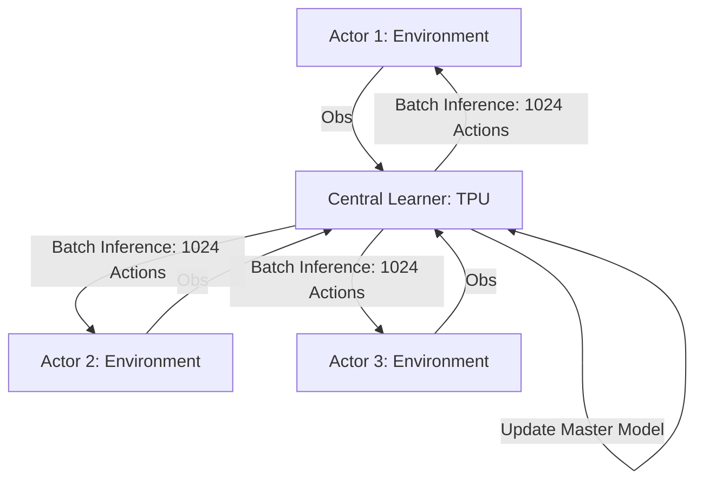

# Seed RL (Massive Scaling)

🧠 **What does this do? (The Analogy)**
Think of a **Giant Supercomputer controlling 1,000,000 Drones**. 
- In standard distributed RL (A3C/IMPALA), each drone has a small brain and tries to do its own math. 
- **Seed RL** is different. The drones are **"Dumb."** They only have a camera and a radio. They send their images to a **Single Giant Brain** (The Seed) sitting in a high-tech lab. 
- The Giant Brain does the math for all 1,000,000 drones at the same time on a TPU/GPU and sends the commands back. 
Because the math is centralized, it is **10x faster and 100x cheaper** than having 1,000,000 small brains.

🔍 **Step-by-Step Explanation:**
1. **Centralized Inference**: All observations are sent to a central learner via gRPC.
2. **TPU Optimization**: Inference and training happen on the same hardware, eliminating the slow "Copying" of weights between computers.
3. **Actor Simplicity**: Actors only run the environment and send data. They don't need a GPU or even a fast CPU.
4. **Benefit**: It can process **millions of frames per second**, allowing an AI to learn to play a game in minutes that used to take days.

📊 **High-Level Design (HLD)**

✅ **Why use this?**
It is the current **Infrastructure Record Holder**. If you have access to a Google Cloud TPU and you want to train an AI on a massive task (like StarCraft II or complex robotics), Seed RL is the architecture you use.

🌍 **Real-World Examples:**
1. **Google AI Research**: Used to train the latest SOTA agents for the Atari-57 benchmark.
2. **Massive Swarm Simulation**: Simulating 100,000 agents in a forest to study wildfire behavior at lightning speed.
