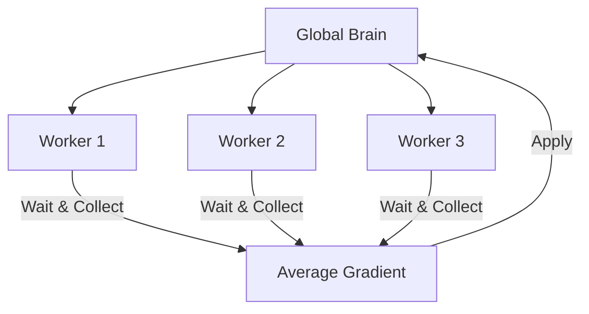

# A2C (Synchronous Advantage Actor-Critic)

🧠 **What does this do? (The Analogy)**
Think of a **Director (Critic)** and an **Actor**. Unlike A3C (where everyone runs in separate rooms), **A2C** is like a **Rehearsal Stage**. The Director watches multiple Actors perform at the same time. The Director waits for everyone to finish their scene, then gives one giant set of notes to everyone at once. It is much more organized and consistent than the "chaos" of A3C.

🔍 **Step-by-Step Explanation:**
1. **Synchronous Workers**: All agents run in parallel and wait for each other to finish a batch of steps.
2. **The Advantage**: We calculate how much "Better than average" each action was: $A = R - V(s)$.
3. **Actor Update**: We make the "Good" actions more likely.
4. **Critic Update**: We make the "Value Estimate" more accurate by reducing the error in the Director's judgment.
5. **Stability**: Because we average the updates from many agents before applying them, the learning is very stable and smooth.

📊 **High-Level Design (HLD)**

✅ **Why use this?**
It is the standard baseline for many RL projects. It is often faster on GPUs than A3C because it can process all agents in a single large matrix (Batching).

🌍 **Real-World Examples:**
1. **Robotic Arm Fleets**: Training 10 identical arms in a factory to pick up items—the arms all share the same learning updates at the end of each shift.
2. **Traffic Signal Control**: Synchronizing traffic lights across an entire district where each light is an agent, but they all learn from the shared "Traffic Flow" data.
