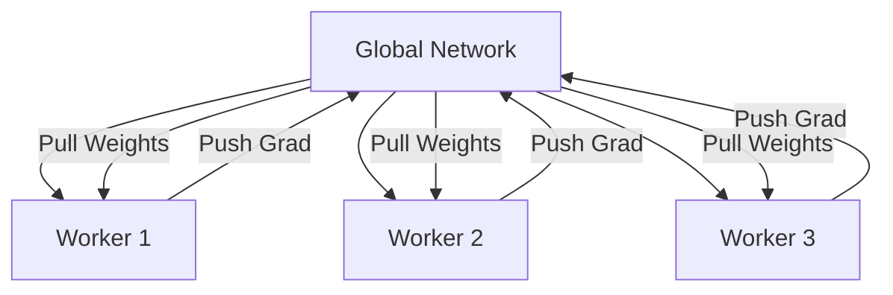

# A3C (Asynchronous Advantage Actor-Critic)

🧠 **What does this do? (The Analogy)**
Think of a **Study Group**. Standard RL is like one person studying alone. **A3C** is like 10 people studying the same textbook in separate rooms. Every time someone learns a new fact, they run to a **Central Blackboard** (Global Network) and write it down. Then they go back to their room and update their own notes. Because 10 people are learning at once and sharing their knowledge "Asynchronously" (without waiting for each other), the whole group becomes experts much faster.

🔍 **Step-by-Step Explanation:**
1. **Parallel Workers**: The algorithm spawns multiple "Worker Agents," each with its own copy of the environment.
2. **Local Updates**: Each worker interacts with its environment and calculates its own gradients (updates).
3. **Global Push**: The worker "pushes" its local update to a Global Network.
4. **Global Pull**: The worker then "pulls" the latest global weights to stay up-to-date with what other workers have learned.
5. **Stability**: Because the workers see different parts of the environment at the same time, the data is less "correlated," making training much more stable.

📊 **High-Level Design (HLD)**

✅ **Why use this?**
It was one of the first algorithms to show that you don't need a "Replay Buffer" to be stable if you have enough parallel workers. It is incredibly fast on multi-core CPUs.

🌍 **Real-World Examples:**
1. **Server Load Balancing**: Training multiple agents to manage traffic in different data centers, all contributing to a single global routing strategy.
2. **Cloud Gaming AI**: Bots in a massive multiplayer game learning from thousands of different matches happening at the same time.
