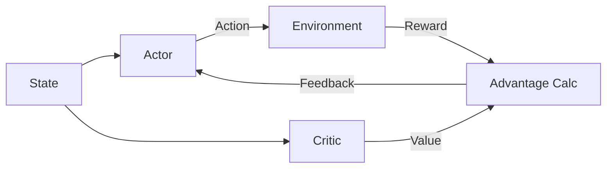

# Actor-Critic (A2C)

🧠 **What does this do? (The Analogy)**
Think of an **Athlete** and a **Coach**. The Athlete (**Actor**) tries to perform moves in the field. The Coach (**Critic**) watches the Athlete and provides a score. If the Coach says "That was better than expected!", the Athlete practices that move more. If the Coach says "That was terrible!", the Athlete tries something else.

🔍 **Step-by-Step Explanation:**
1. **The Actor (Policy)**:
   - Takes the state and outputs the probability of each action.
   - It's the "Muscle" of the system.
2. **The Critic (Value Function)**:
   - Predicts the total reward the agent will get from the current state.
   - It's the "Brain" that evaluates the state.
3. **The Advantage (TD Error)**:
   - $Advantage = Reward + NextValue - CurrentValue$
   - This is the feedback. A positive advantage means the action was a "pleasant surprise."
4. **The Update**:
   - The Actor is updated to increase the probability of actions with positive advantage.

📊 **High-Level Design (HLD)**

✅ **Why use this?**
Standard Policy Gradient (REINFORCE) is very "noisy." By using a Critic to reduce that noise (Variance), A2C learns much faster and more stably.

🌍 **Real-World Examples:**
1. **Traffic Light Control**: The Actor decides light timings, while the Critic evaluates the overall traffic flow (waiting time).
2. **Industrial Robots**: The Actor moves the robot arm, while the Critic predicts if the current posture will lead to a successful pick-and-place.
