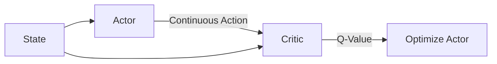

# Deep Deterministic Policy Gradient (DDPG)

🧠 **What does this do? (The Analogy)**
Think of a **Thermostat**. Standard DQN is like a switch that only has "ON" or "OFF." DDPG is like a dial that you can turn to **any** degree (e.g., 22.5°C). It allows the AI to control things smoothly and precisely rather than just picking from a list of buttons.

🔍 **Step-by-Step Explanation:**
1. **The Deterministic Actor**:
   - Instead of outputting probabilities, it outputs a specific continuous value (e.g., "Rotate 15.2 degrees").
2. **The Critic**:
   - Takes both the state and the actor's action and tells the actor: "If you do that in this state, you'll get this much reward."
3. **The Policy Gradient**:
   - The Actor updates its weights by "climbing" the gradient of the Critic's Q-values. It literally moves toward actions that the Critic likes.

📊 **High-Level Design (HLD)**

✅ **Why use this?**
It is the foundation for robotics. If you want a robot to walk, it can't just choose between "Left Leg Up" or "Down"—it needs to precisely control the torque of every motor at every millisecond.

🌍 **Real-World Examples:**
1. **Autonomous Braking**: Calculating the exact pressure to apply to brakes based on speed and distance (not just "Brake" or "Don't Brake").
2. **Industrial Cooling**: Adjusting valve openings to maintain precise temperatures in a server farm.
