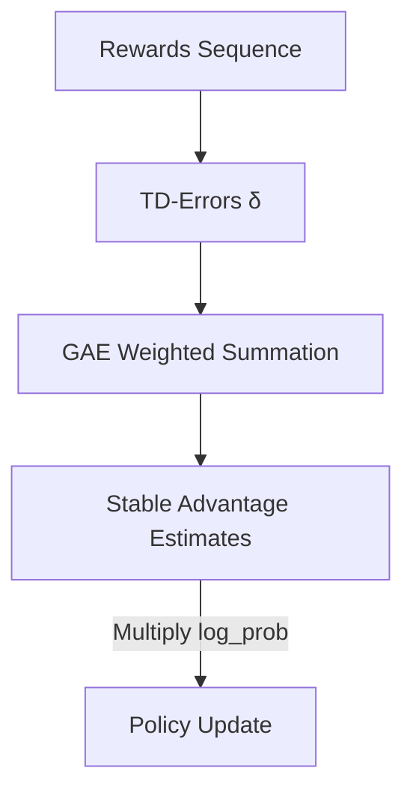

# Generalized Advantage Estimation (GAE)

🧠 **What does this do? (The Analogy)**
Think of an **Expert Critic** who is also a **Fortune Teller**. If a critic only looks at one step (TD-0), they are very biased. If they look at the whole game (MC), they are very inconsistent (High Variance). **GAE** is a "Smart Average." It looks at the next step, the next 2 steps, the next 3 steps... all the way to the end of the game, and gives a weighted average. It perfectly balances **"Bias"** (guessing) and **"Variance"** (luck).

🔍 **Step-by-Step Explanation:**
1. **The TD-Error ($\delta$)**: The immediate surprise: $r + \gamma V(s') - V(s)$.
2. **Lambda ($\lambda$)**: The magic hyperparameter. 
   - If $\lambda=0$, it is standard 1-step TD (Low variance, High bias).
   - If $\lambda=1$, it is standard Monte Carlo (High variance, Low bias).
3. **The GAE Formula**: It exponentially decays the TD-errors of future steps.
4. **The Benefit**: It is the "Engine" inside PPO. Without GAE, policy gradients are too unstable to learn anything complex.

📊 **High-Level Design (HLD)**

✅ **Why use this?**
Because every major policy gradient algorithm (PPO, TRPO, A3C) uses it. It is the single most important mathematical trick for making RL work in the real world.

🌍 **Real-World Examples:**
1. **Autonomous Braking**: Deciding if a braking action was "good" by looking at the outcome 1 second, 2 seconds, and 5 seconds later, all at once.
2. **Industrial Control**: Evaluating a change in temperature by looking at the average stability of the machine over the next 10 minutes, rather than just the next 10 seconds.
