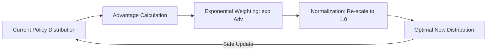

# Mirror Descent Policy Optimization

🧠 **What does this do? (The Analogy)**
Think of a **Compass on a Map**. 
- Standard Gradient Descent says: "Move 1cm North." 
- **Mirror Descent** says: "Move toward the North Star, but **Scale your movement** based on how far away you are." 
It is a generalized way of moving that "Respects the Geometry" of the space. In RL, our space is "Probability." Mirror Descent ensures that our update to the AI's brain doesn't just change the numbers, but changes the **Confidence** of the AI in a way that is mathematically optimal and stable.

🔍 **Step-by-Step Explanation:**
1. **The Proximal Operator**: It minimizes $ \langle \pi, A \rangle - \frac{1}{\eta} D_{KL}(\pi || \pi_{old}) $.
2. **Trade-off**: It balances "Maximizing Advantage" ($A$) with "Staying close to the old policy" ($D_{KL}$).
3. **Closed-form Solution**: For many cases, the answer is simply to multiply the old probability by $e^{Advantage}$.
4. **Benefit**: It is the **Math Proof** that PPO and TRPO actually work. It provides a formal guarantee that the policy will improve every single step without ever "crashing" the brain.

📊 **High-Level Design (HLD)**

✅ **Why use this?**
It is the "Foundational Theory" of modern RL. If you are a researcher trying to build the "Next PPO," you start with the math of Mirror Descent. It ensures that your AI learns in the most "Energy Efficient" way possible on the probability manifold.

🌍 **Real-World Examples:**
1. **PPO/TRPO Implementations**: Every time you use PPO, you are using a practical version of Mirror Descent.
2. **Online Convex Optimization**: Managing a stream of data (like user clicks) where you need to adapt your strategy instantly but safely.
