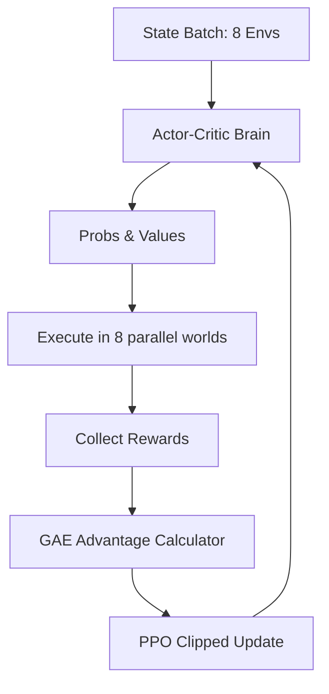

# PPO with GAE (High-Performance Engine)

🧠 **What does this do? (The Big Picture)**
Think of a **Super-Fast Learner**. Most RL algorithms are like a student who reads one page, thinks for 10 minutes, and then reads the next page. **Vectorized PPO** is like a student who has **8 clones** of themselves. Each clone reads a different book at the same time and sends their summaries back to the original brain. **GAE (Generalized Advantage Estimation)** is like the "Perfect Memory" of the student, ensuring they perfectly balance their "Initial Guesses" with the "Final Results."

🔍 **The Technical Breakthroughs:**

1.  **Vectorized Environments**: Running multiple copies of the game in parallel. This breaks the correlation between samples and fills up the GPU/CPU efficiently.
2.  **GAE (Advantage Estimation)**: $A_t^{GAE} = \sum (\gamma \lambda)^k \delta_{t+k}$.
    - It is a weighted average of looking 1 step ahead, 2 steps ahead, ..., all the way to the end of the game.
    - It allows for the perfect balance between **Bias** (trusting the brain) and **Variance** (trusting the game score).
3.  **Clipped Objective**: $L = \min(r_t A_t, \text{clip}(r_t, 1-\epsilon, 1+\epsilon) A_t)$.
    - It prevents the AI from making a "massive mistake" that ruins its brain. It only allows small, safe updates.

📊 **High-Level Design (HLD)**

✅ **Why use this?**
This is the **most popular RL algorithm in the world**. If you don't know which algorithm to pick for a new project, **pick PPO with GAE**. It is incredibly stable, works for almost every problem, and can be scaled to thousands of CPU cores (like OpenAI did to beat the world champions at Dota 2).

🌍 **Real-World Examples:**
1. **Dota 2 / StarCraft AI**: OpenAI Five used this exact vectorized PPO architecture to collect 180 years of game experience every single day.
2. **Industrial HVAC Control**: Managing the heating and cooling of a massive data center by running hundreds of "Parallel Simulations" of different rooms to find the most energy-efficient settings.
