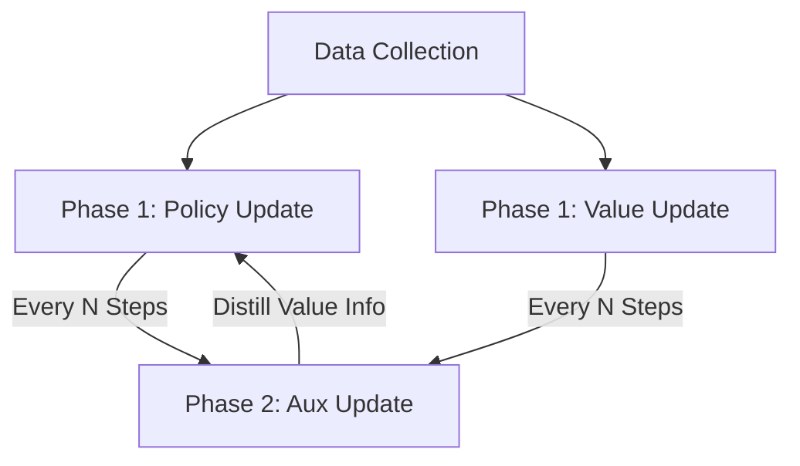

# Phasic Policy Gradient (PPG)

🧠 **What does this do? (The Analogy)**
Think of a **Student (Actor) and a Tutor (Critic)**. In standard PPO, they are forced to share the same brain, which leads to arguments (Interference). **PPG** gives them **separate brains** but forces them to meet every Sunday for a **"Knowledge Sharing Session"** (Auxiliary Phase). The Tutor shows the Student their notes, and the Student updates their understanding of the world. This way, they don't interfere during the week, but they still learn from each other.

🔍 **Step-by-Step Explanation:**
1. **The Conflict**: Policy networks want to learn actions; Value networks want to learn the environment. In PPO, sharing a network can cause "catastrophic forgetting."
2. **Policy Phase**: The Actor and Critic are updated independently using standard PPO logic.
3. **Auxiliary Phase**: Every $N$ steps, a special update happens where the policy network tries to predict the value function's targets.
4. **The Benefit**: It keeps the "features" (internal logic) of the policy network high-quality without the risk of the value update ruining the actor's performance.

📊 **High-Level Design (HLD)**

✅ **Why use this?**
It is the **state-of-the-art successor to PPO**. It is significantly more stable and achieves much higher scores on complex games like those in the Procgen benchmark.

🌍 **Real-World Examples:**
1. **Robotic Hand Assembly**: A robot learning to use tools where the "Value" (understanding depth) and the "Actor" (motor control) are both complex and need to be decoupled.
2. **Autonomous Navigation**: Managing a car's vision system (Value) and steering (Actor) separately to prevent a change in "lighting detection" from accidentally causing a sharp turn.
