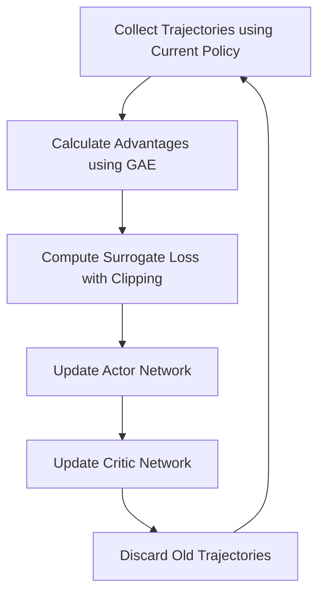

# Proximal Policy Optimization (PPO) Deep Dive

## Introduction
PPO is one of the most popular Reinforcement Learning algorithms today, used by OpenAI for projects like ChatGPT (RLHF) and Dota 2. It belongs to the **Policy Gradient** family and is designed to be stable, robust, and easy to tune.

## Core Concepts

### 1. On-Policy Learning
Unlike DQN, PPO is **On-Policy**. It learns from the data it is currently collecting. Once the data is used for an update, it is discarded.

### 2. Actor-Critic Architecture
- **Actor**: Decides which action to take (Policy).
- **Critic**: Predicts how much reward the agent will get (Value Function).

### 3. Clipped Objective Function
The "Proximal" in PPO comes from the fact that it prevents the policy from changing too much in a single update. It "clips" the objective function to ensure the new policy is close to the old one, avoiding catastrophic performance drops.

## High-Level Design (HLD)



## Why PPO is Better?
- **Stability**: Clipping ensures that training doesn't explode.
- **Versatility**: Works for both **Discrete** and **Continuous** action spaces.
- **Efficiency**: Better sample efficiency compared to older policy gradient methods like REINFORCE or TRPO.

### Pros and Cons
| Pros | Cons |
| :--- | :--- |
| Very stable and reliable | Sample inefficient (requires many steps) |
| Works with continuous actions | Sensitive to reward scaling |
| Industry standard for many tasks | On-policy (cannot reuse old data) |

---

## Interview Questions (Q&A)

**Q: What is the main difference between PPO and DQN?**
A: PPO is a **Policy Gradient** method (learns the policy directly) and is **On-Policy**. DQN is a **Value-Based** method (learns Q-values) and is **Off-Policy**.

**Q: Why do we use clipping in PPO?**
A: Clipping prevents the policy from making huge updates that might lead to a collapse in performance. It keeps the "trust region" small.

**Q: What is GAE (Generalized Advantage Estimation)?**
A: GAE is a method used in PPO to reduce the variance of advantage estimates, helping the agent learn faster and more reliably.

## 📜 PPO Algorithm Pseudocode
```text
FOR iteration = 1, 2, ...:
    1. Collect trajectory by running policy π_old for T steps
    2. Compute advantages Â_t using GAE (Generalized Advantage Estimation)
    3. FOR epoch = 1 to N_epochs:
        - Compute ratio: r_t(θ) = π_θ(a_t|s_t) / π_old(a_t|s_t)
        - Compute Clipped Loss: L = min(r_t*Â_t, clip(r_t, 1-ε, 1+ε)*Â_t)
        - Update parameters using L + ValueLoss + Entropy
    UNTIL convergence
```
